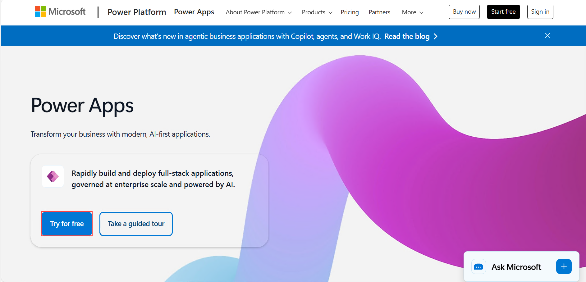
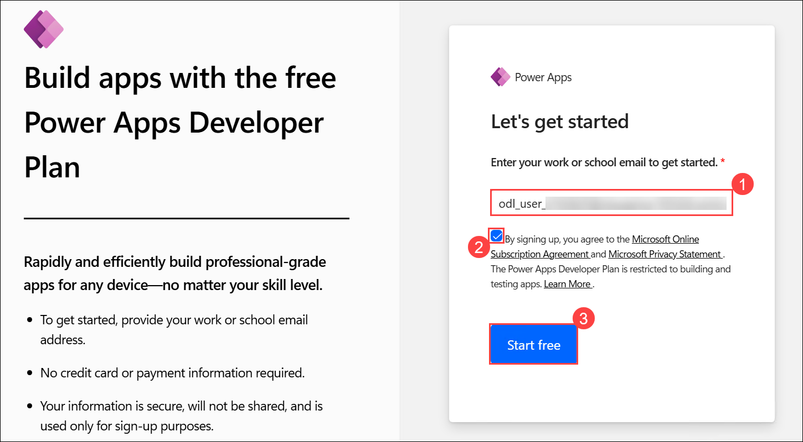
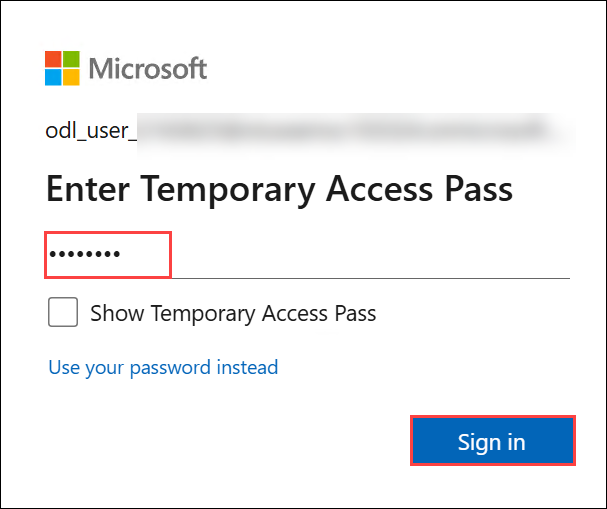
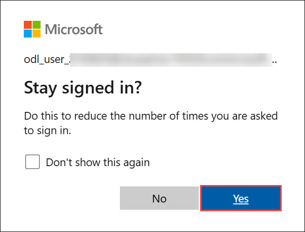
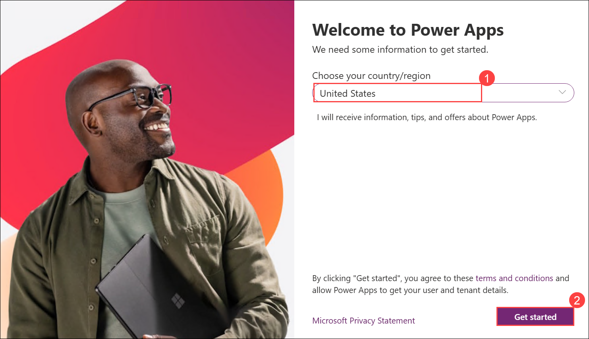
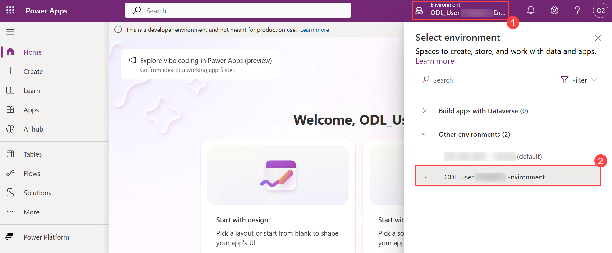
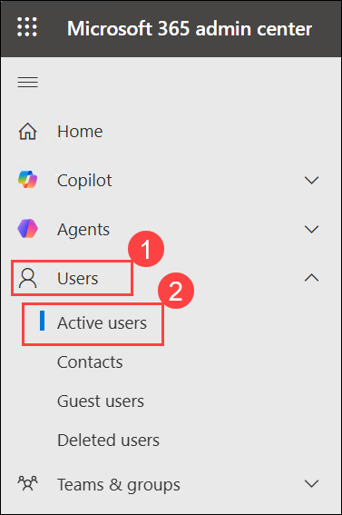
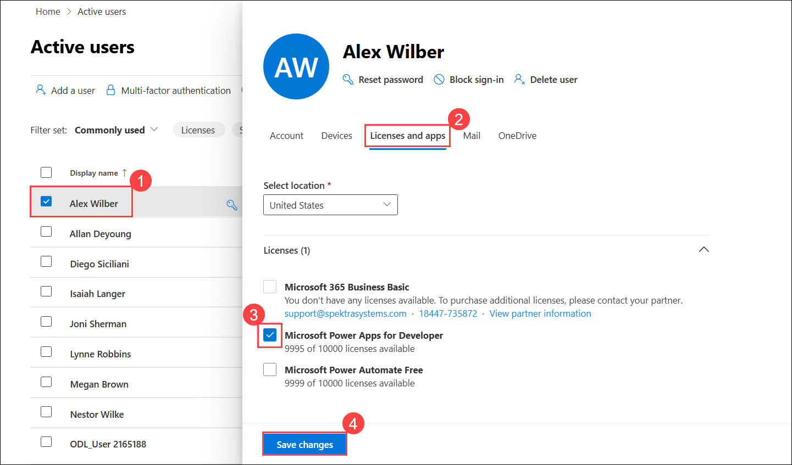
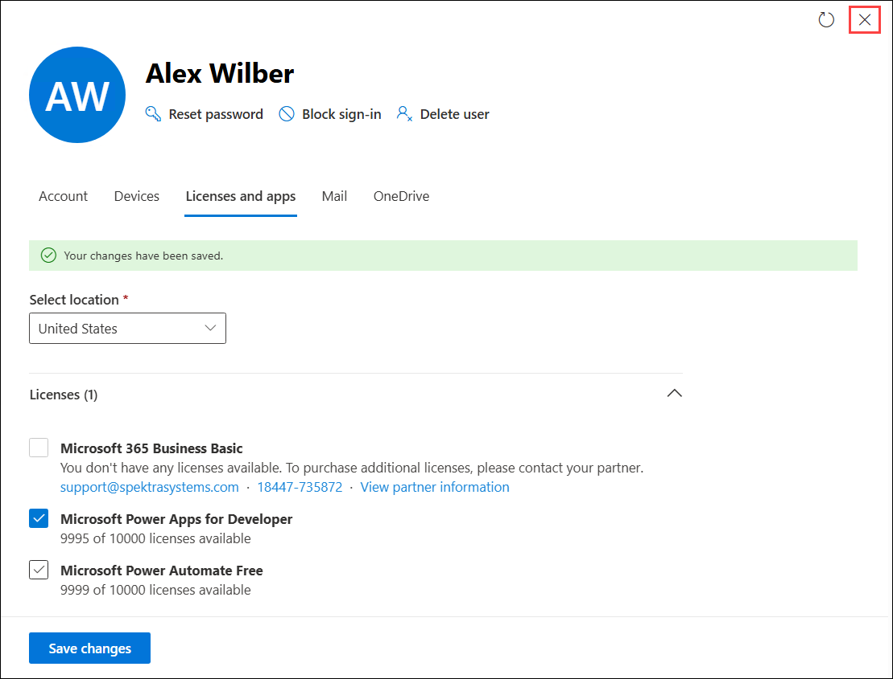

# Lab 0: Validate lab environment

> **IMPORTANT:** This lab provides you with a Microsoft 365 tenant and licenses for the Power Platform applications you will be using in this course. You will only be provided with one tenant for the practice labs in this course. The settings and actions you take within this tenant do not roll-back or reset, whereas the virtual machine you are provided with does reset each time you close the lab session. Please be aware that Microsoft 365 and Power Platform are evolving all the time. The instructions in this document may be different from what you experience in your actual tenant. It is also possible to experience a delay of several minutes before the virtual machine has network connectivity to begin the labs.

# WWL Tenants - Terms of Use
If you are being provided with a tenant as a part of an instructor-led training delivery, please note that the tenant is made available for the purpose of supporting the hands-on labs in the instructor-led training. Tenants should not be shared or used for purposes outside of hands-on labs. The tenant used in this course is a trial tenant and cannot be used or accessed after the class is over and are not eligible for extension. Tenants must not be converted to a paid subscription. Tenants obtained as a part of this course remain the property of Microsoft Corporation and we reserve the right to obtain access and repossess at any time. 

## Lab objectives
In this lab, you will perform:

+ Exercise 1: Access Microsoft Power Platform
+ Exercise 2: Assign License to the users
  
## Exercise 1: Access Microsoft Power Platform

In this exercise, you will add a Power Apps trial to the tenant and assign licenses to users.

### Task 1.1: Sign in to Power Apps

1.  Verify that you have your **Microsoft 365 credentials** from the Authorized Lab Host available. 

2.  In a new browser tab, navigate to `https://powerapps.microsoft.com` and select **Try for free**.

    

1. On the **Let’s get started** page, enter your email address **(1)**, select the agreement checkbox **(2)**, and then click **Start free (3)**.
 
   - **Email/Username:** <inject key="AzureAdUserEmail"></inject>
    
     

1. Enter the following password and click **Sign in**:

   - **Password:** <inject key="AzureAdUserPassword"></inject>
    
     

1.  Select **Yes** to stay signed in.

    

1. If prompted for contact information, leave the Country/region **(1)** as the default value and select **Submit (2)**.

    

8.  At the top right of the screen, verify that the **Environment** is set to **ODL_User<inject key="DeploymentID"></inject> (1)**. If it is not, select the **ODL_User<inject key="DeploymentID"></inject> (2)** environment.

    

## Exercise 2: Assign License to the users

In this exercise, you'll assign license to the following user through the Microsoft 365 admin center.

### Task 2.1: Assign license to users

1. Navigate to the Microsoft 365 admin center using the following URL: `https://admin.cloud.microsoft`

1. If prompted, sign in using the following credentials:

    - **Email/Username:** <inject key="AzureAdUserEmail"></inject>

    - **Password:** <inject key="AzureAdUserPassword"></inject>

1. From the left navigation pane, select **Users (1)** and then select **Active users (2)**.

    

1. From the list of Active users, select **Alex Wilber (1)**. In the **Alex Wilber** pane on the right, select the **Licenses and apps (2)** tab and then check the box next to **Microsoft Power Apps for Developer (3)** and then select **Save changes (4)**. 

    

1. Now close the pane using the **X** icon on the top right.

    

1. Now perform the **step 3 and 4** for the following users as well to assign them **Microsoft Power Apps for Developer** license :

    - **Megan Brown**
    - **Patti Fernandez**

## Review
In this lab, you validated the lab environment by accessing the Power Platform, activating a trial, and verifying environment settings. You also assigned Power Apps licenses to users through the Microsoft 365 admin center, ensuring all users have the required access to perform the labs successfully. Great work!

### You have successfully completed the lab. Click on Next >> to proceed with the next lab.

