# Lab 1.1: Create environments

## Scenario

In this lab, you create environments for use during the remainder of the labs.

## Lab objectives
In this lab, you will perform:

+ Task 1: Create development environment
+ Task 2: Create live environment

## Exercise 1 - Create environments

In this exercise, you will create a *Development* environment that you will do the majority of your lab work in and a *Live* environment to deploy solutions into.

**Note:** Depending on the browser that you are using, it is suggested that you disable any pop-up blockers that maybe enabled. This will allow pop-up windows to appear as they should.

### Task 1.1 – Create development environment

1.  Navigate to the Power Platform admin center `https://aka.ms/ppac`  and sign in with your Microsoft 365 credentials if prompted again.
     
    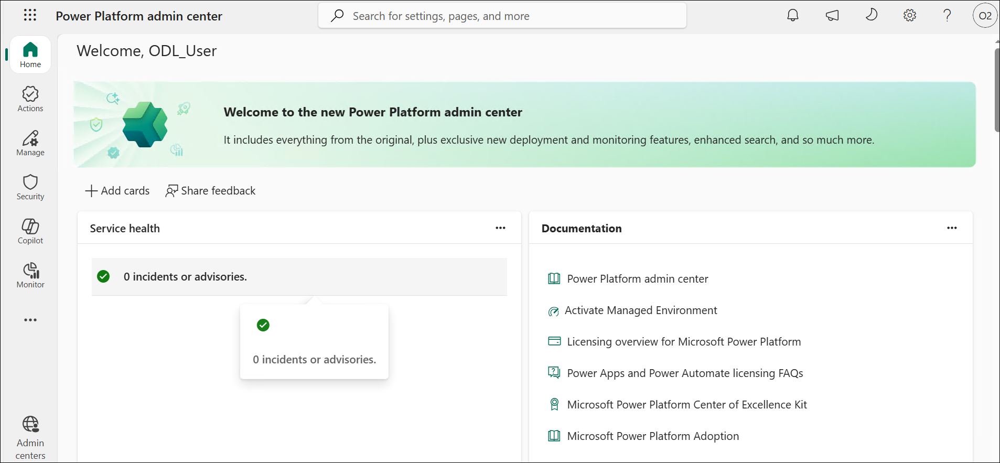 

1.  Select **Manage (1)** and then select **Environments (2)** from the left navigation pane. There should be two environments, There should be a two environment, **OTU WA MOC XXXXXX**(default) and **ODL_User<inject key="DeploymentID"></inject>** (Developer).

    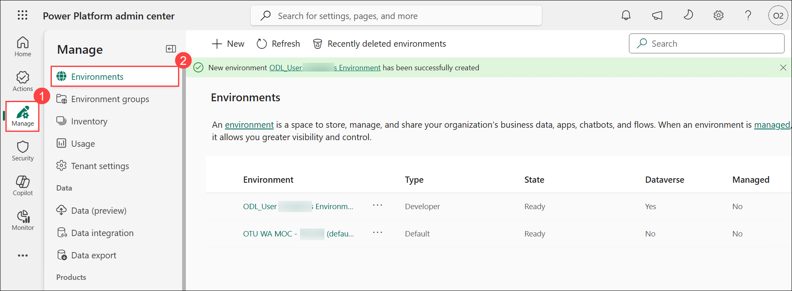

1. Select the **ODL_User<inject key="DeploymentID"></inject>** environment by selecting the **ellipsis (...)** **(1)** and from the menu select **Settings (2)**.

    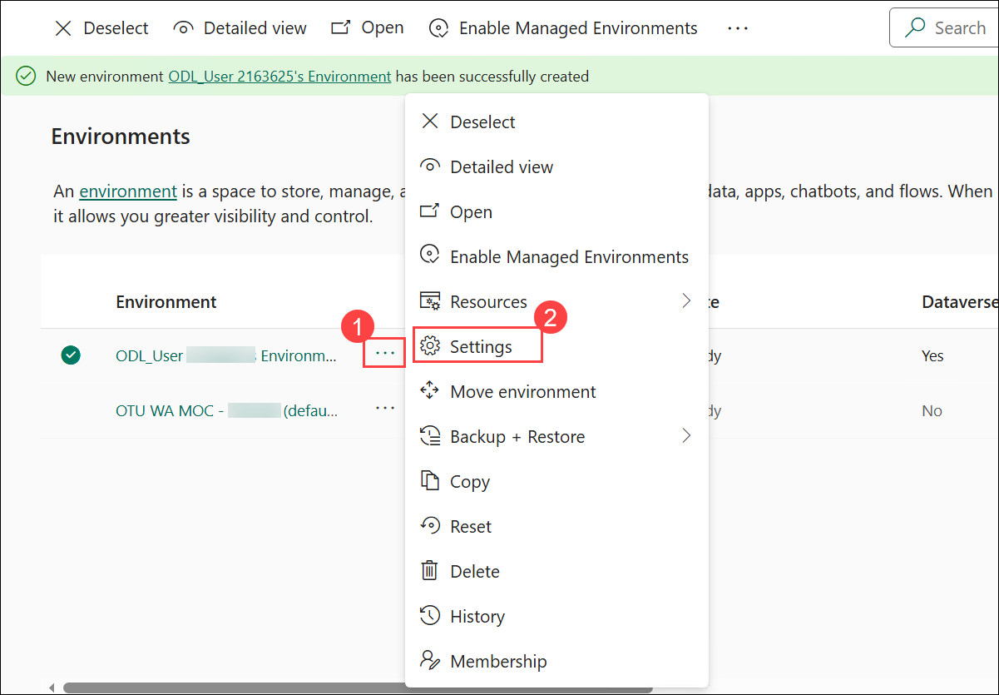

1. Explore the different areas in **Settings** that you may be interested in but do not make any changes yet.

### Task 1.2 - Create the production environment

1. Navigate to Environments in the Power Platform admin center by selecting **Environment** from the left navigation pane.

    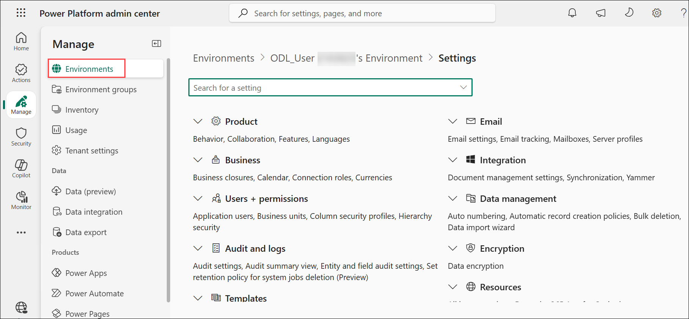

1.  Now select **+ New**.

    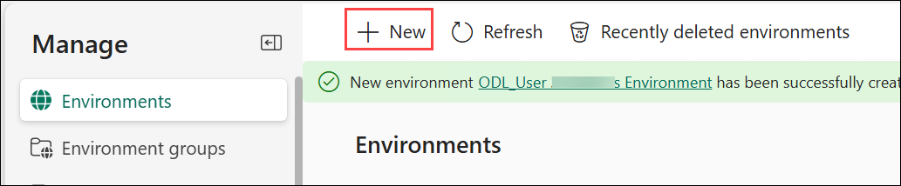

1.  In the **Name** text box, enter **[my initials] Development (1)**. (Example: PL Development).

1.  In the **Type** drop down, select **Developer (2)**.

1.  Leave all other selections as default and select **Next (3)**.

    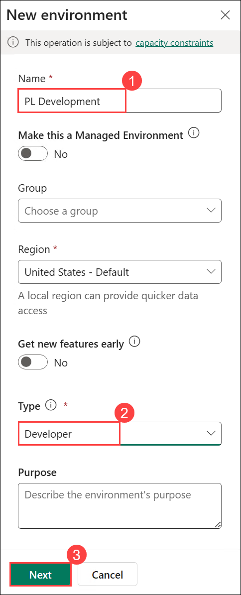

1.  On the **Add Dataverse** tab, select **Save**.

    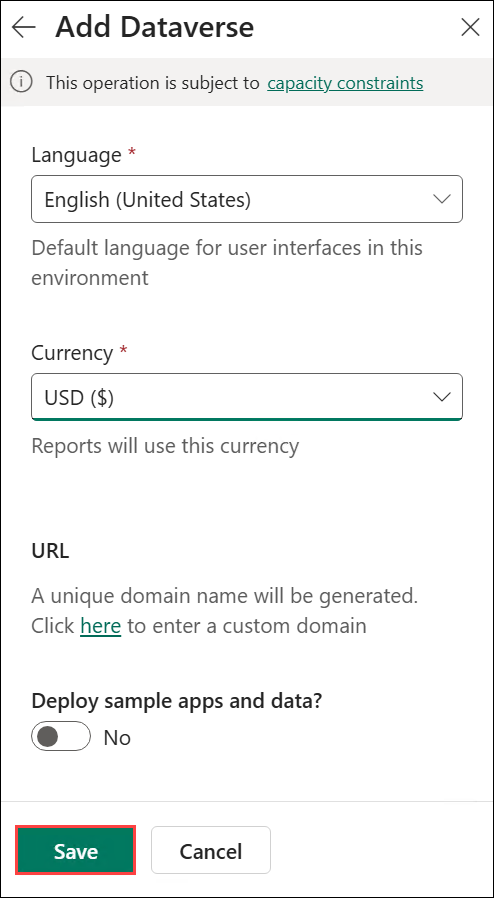

1.  Wait while the Production environment takes a few minutes to provision. Select **Refresh** if needed. It is finished when the State shows as **Ready**.

      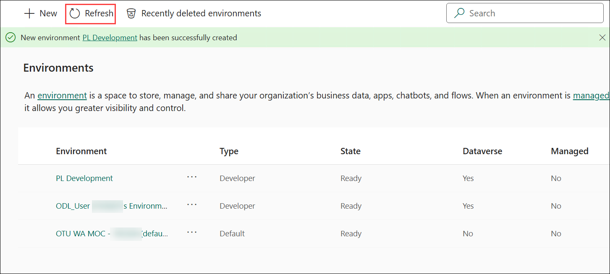

1. You should now see the following environments:

    

    >**Note:** You will use the **ODL_User<inject key="DeploymentID"></inject>** environment for all customizations in the labs. The **Production** environment will act as your live environment to import completed solutions into.

### Task 1.3 – Verify Classic solution explorer is enabled

1. Navigate to environments in the Power Platform admin center `https://admin.powerplatform.microsoft.com/manage/environments`.

1. Select the **ODL_User<inject key="DeploymentID"></inject>** environment. Click on the **ellipses (...) (1)** next to its name to expand the drop down menu and select **Settings (2)**.

     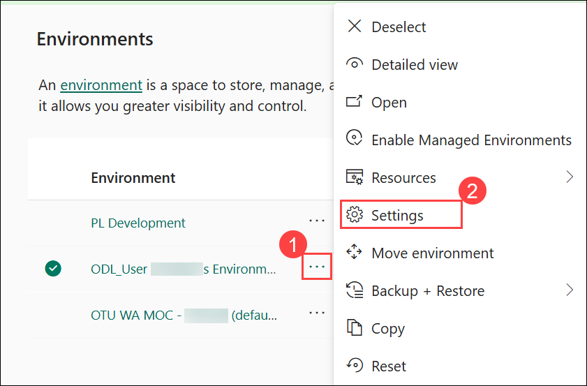

1.  Expand **Product (1)** and select **Behavior (2)**.

    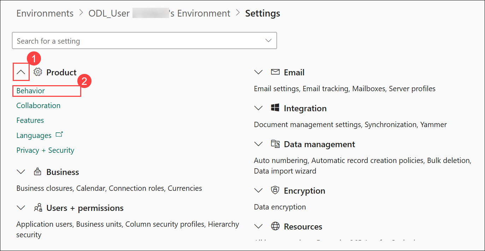

1. Under **Display behavior**, verify that Show the **Switch to classic buttons in Power Apps** is set to **On**.

    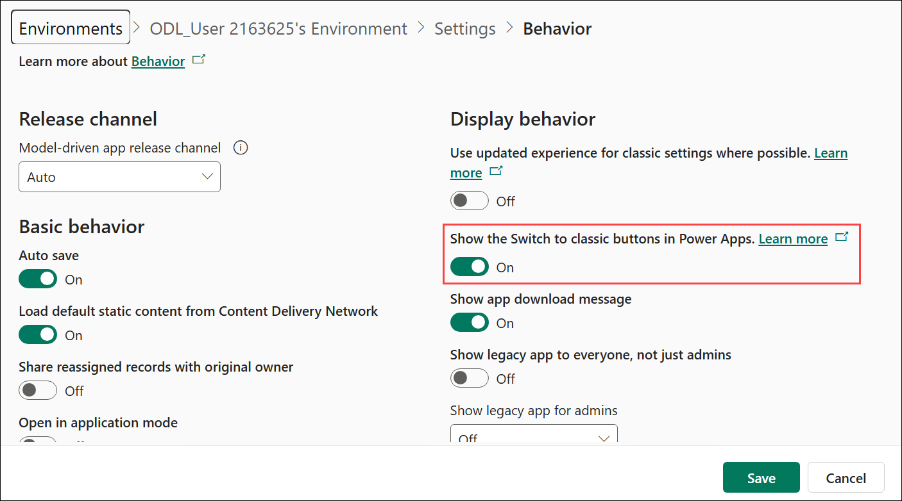

1. If necessary, select **Save**. Otherwise, click on **Cancel** and then select **Confirm**.

    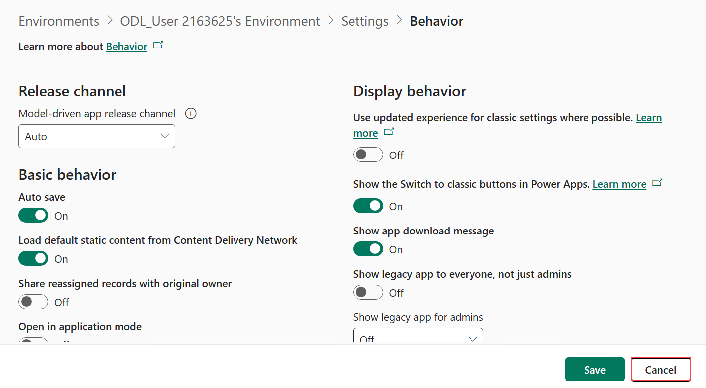

    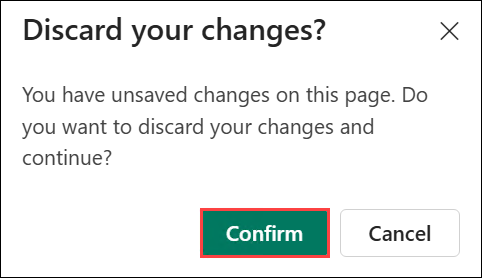
   
> **Note:** You will use the *Development* environment for all customizations in the labs. The *Live* environment will act as your test/production environment.

> **Congratulations** on completing the task! Now, it's time to validate it. Here are the steps:
 
- Navigate to the Lab Validation Page, from the upper right corner in the lab guide section.
- Hit the Validate button for the corresponding task. If you receive a success message, you can proceed to the next task. 
- If not, carefully read the error message and retry the step, following the instructions in the lab guide.
- If you need any assistance, please contact us at labs-support@spektrasystems.com. We are available 24/7 to help you out.
  

### Review
In this lab, you created a development environment and a live environment.

