# Lab 1.2: Publisher and Solution

## Scenario

In this lab, you will create a publisher and a solution.

## Lab objectives
In this lab, you will perform:

+ Exercise 1: Create publisher and solution
+ Exercise 2: Add components to the solution

## Exercise 1 - Create publisher and solution

In this exercise, you will access the Power Apps maker portal, the Development environment and create a new solution.

### Task 1.1 – Maker portal

1. Navigate to the Power Apps Maker portal `https://make.powerapps.com` and sign in with your Microsoft 365 credentials given below if prompted again.

    - **Email/Username:** <inject key="AzureAdUserEmail"></inject>

    - **Password:** <inject key="AzureAdUserPassword"></inject>

1. If you are prompted for a **Phone number** enter `0123456789` and select **Submit**.

1. Switch environments by using the Environment Selector in the upper right corner of the screen.

    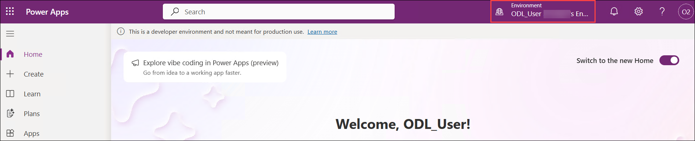

1. If **ODL_User<inject key="DeploymentID"></inject>** environment is not selected then click on **Environment (1)** and then select the **ODL_User<inject key="DeploymentID"></inject> (2)** environment from the list.
    
    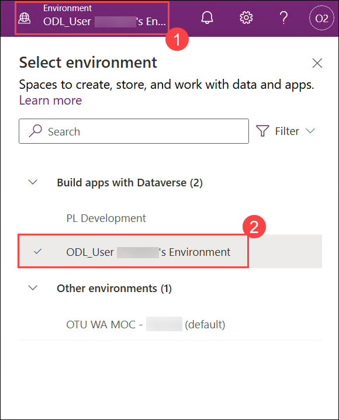

1. Select **Apps (1)** from the left navigation pane and then select **All (2)**. You should see several apps including, Power Platform Environment Settings, Solution Health Hub, and Power Pages Management listed.

    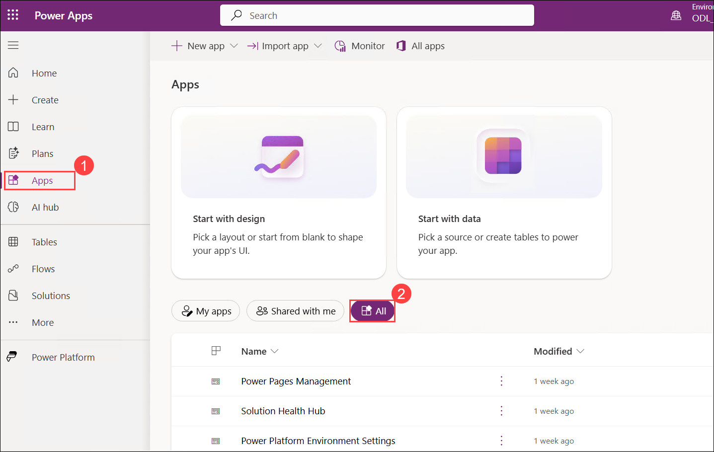

1. Select **Tables** from the left navigation pane. You should see the standard tables from the Common Data Model including Account and Contact.

    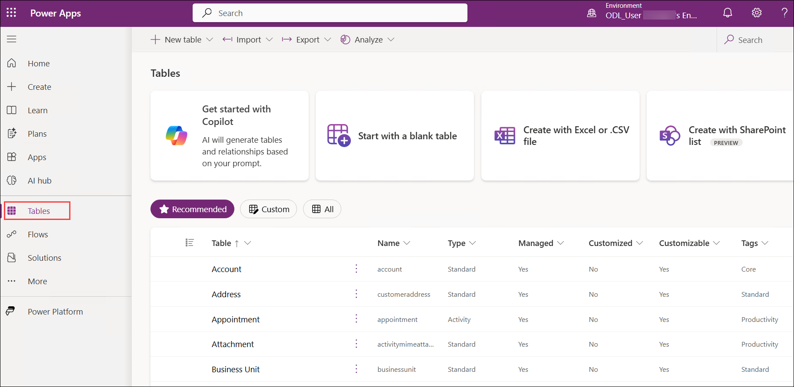

### Task 1.2 – Create solution and publisher

1. Select **Solutions** from the left navigation pane. You should see several solutions including the Default Solution and the Common Data Services Default Solution.
  
    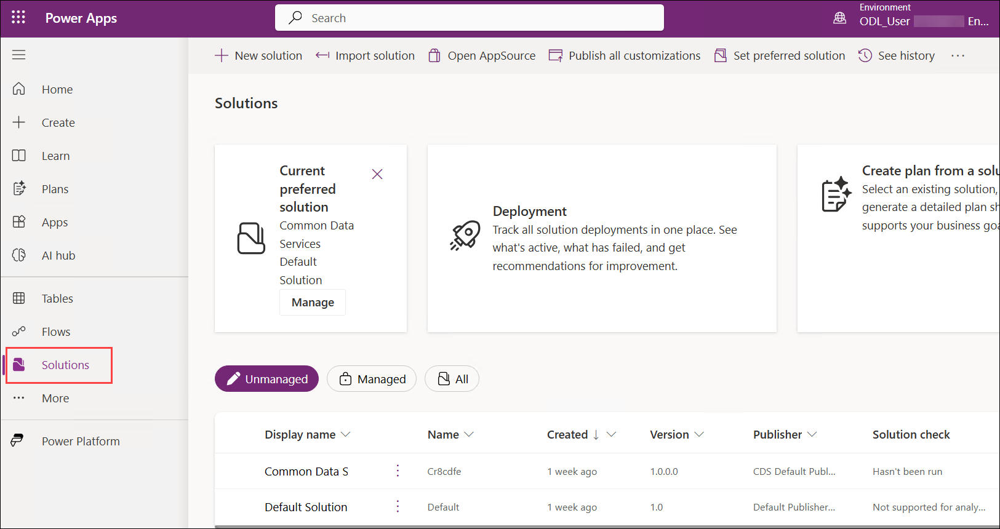

1. Select **+ New solution**.

    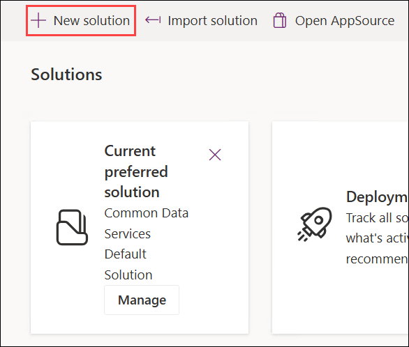

1. In the **Display name** text box, enter `PL Practice` **(1)** solution.

1. Verify that **Name** is automatically populated.

1. Select **+ New publisher (2)** below the Publisher drop-down.

    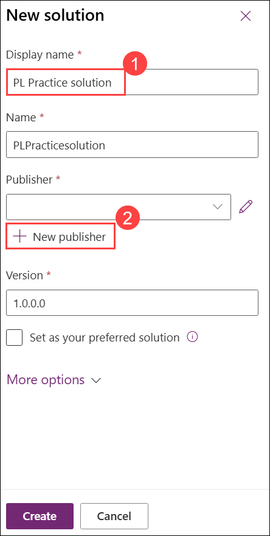

1. In the **Display name (1)** text box, enter `Fabrikam`

1. In the **Name (2)** text box, enter `fabrikam`

1. In the **Prefix (3)** text box, enter `fab`

1. Select **Save (4)**.

   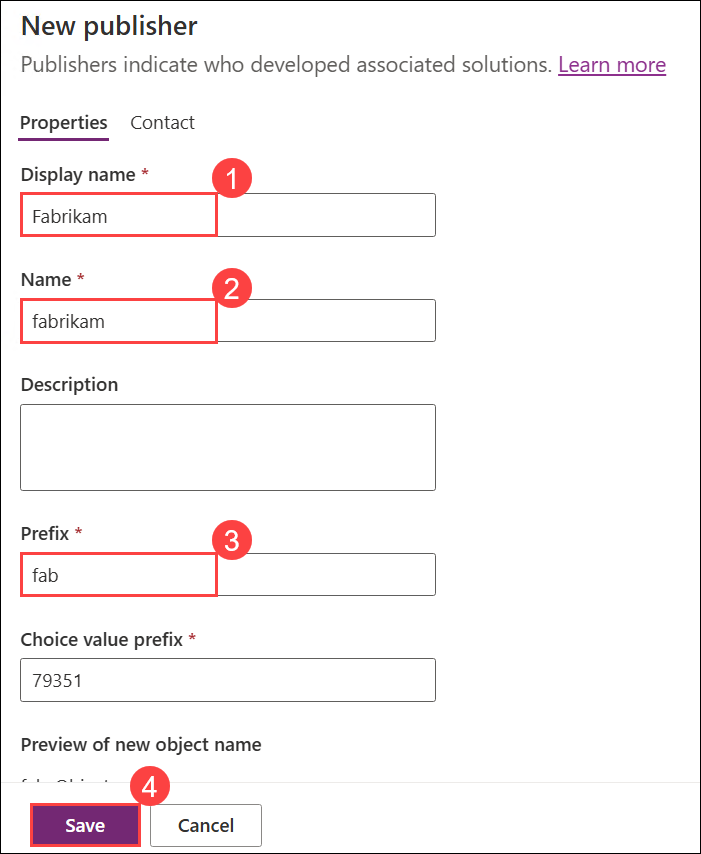

1. In the **Publisher** drop-down, select **Fabrikam (fabrikam) (1)**.

1. Select **Create (2)**.

    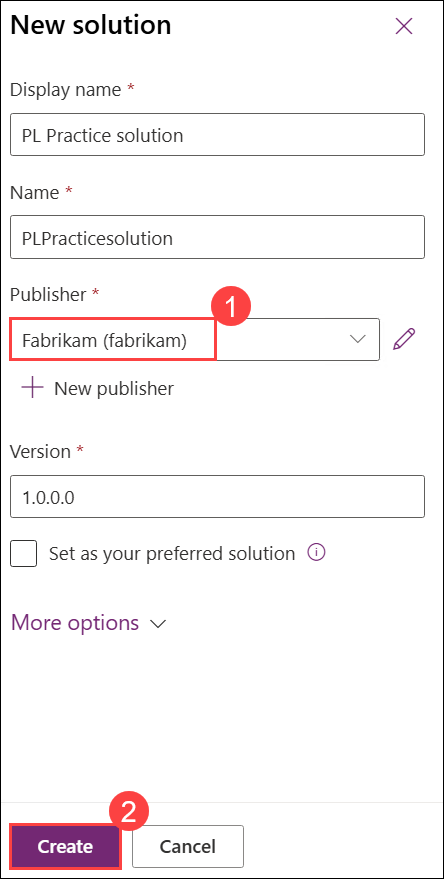

## Exercise 2 - Add components to the solution

In this exercise, you will add an existing table to the solution.

### Task 2.1 – Add table

1. Navigate to the Power Apps Maker portal `https://make.powerapps.com`

1. Make sure you are in the **ODL_User<inject key="DeploymentID"></inject>** environment.

1. Select **Solutions (1)** from the left pane.

1. Select the **Practice solution (2)**, from the previous exercise.

    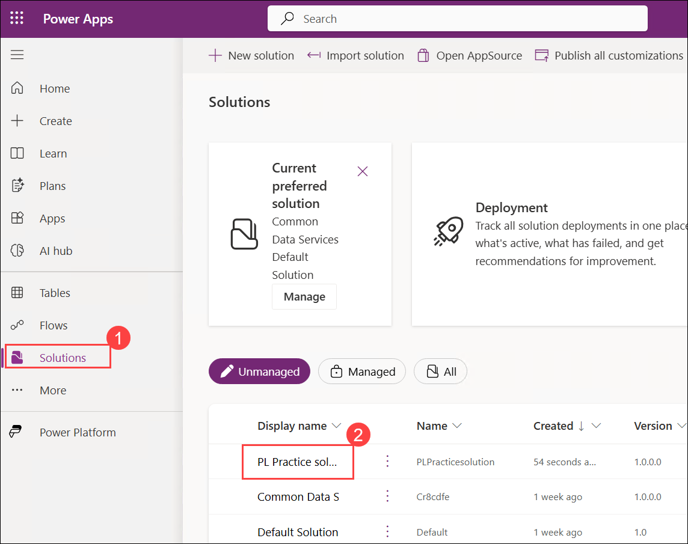

1. Select **Add existing (1)** and choose **Table (2)**.

    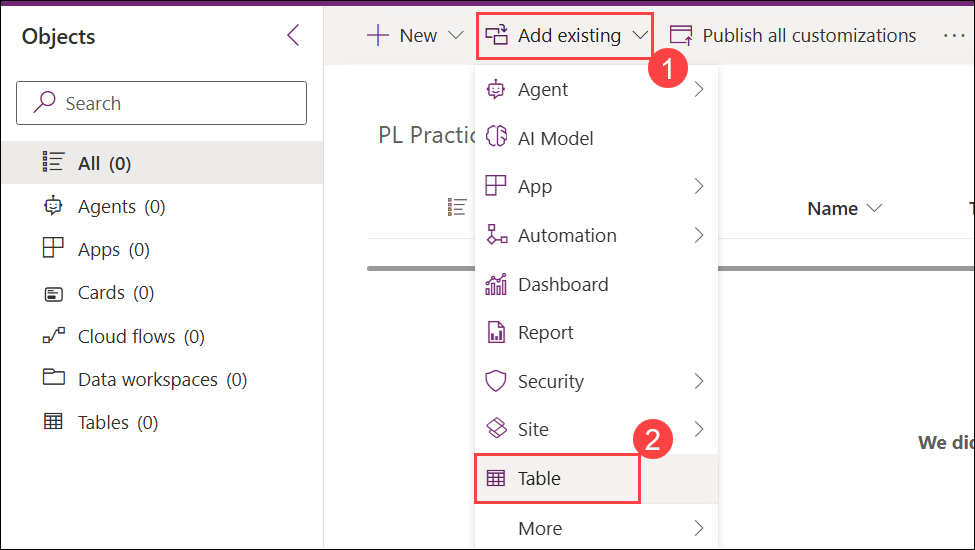

1. Select the **Account (1)** table and then click on **Next (2)**.

    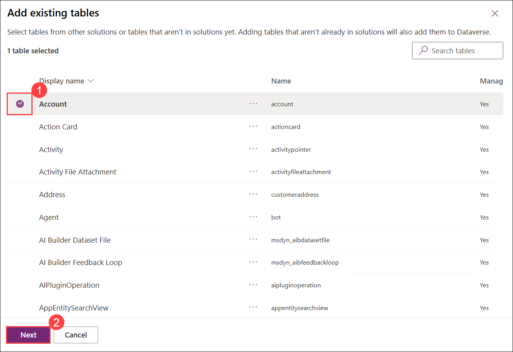

1. Under the **Account** table, select the **Edit objects** link.

    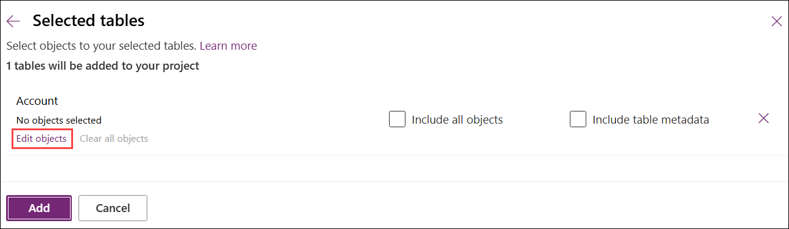

1. In the **Columns** tab, select the following column **Account Number**.

    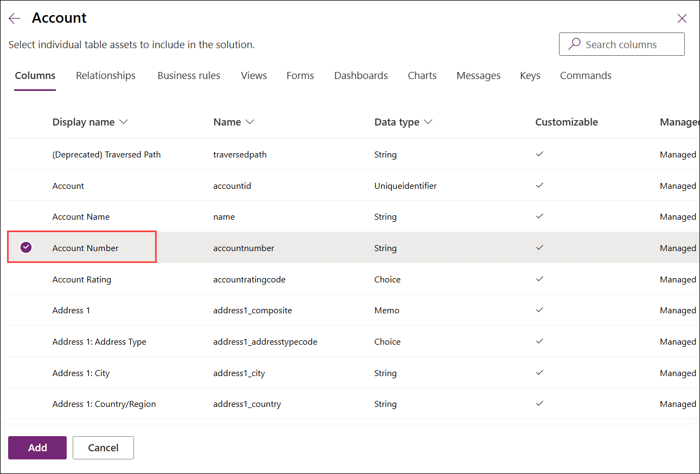

1. Select the **Views (1)** tab and select the **Active Accounts (2)** view.

    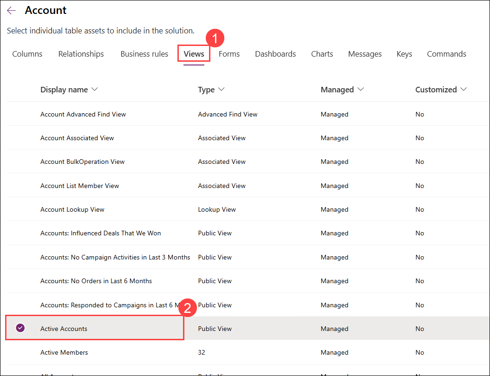

1. Select the **Forms (1)** tab, then select the **Account (2)** form and then click on **Add (3)**.

    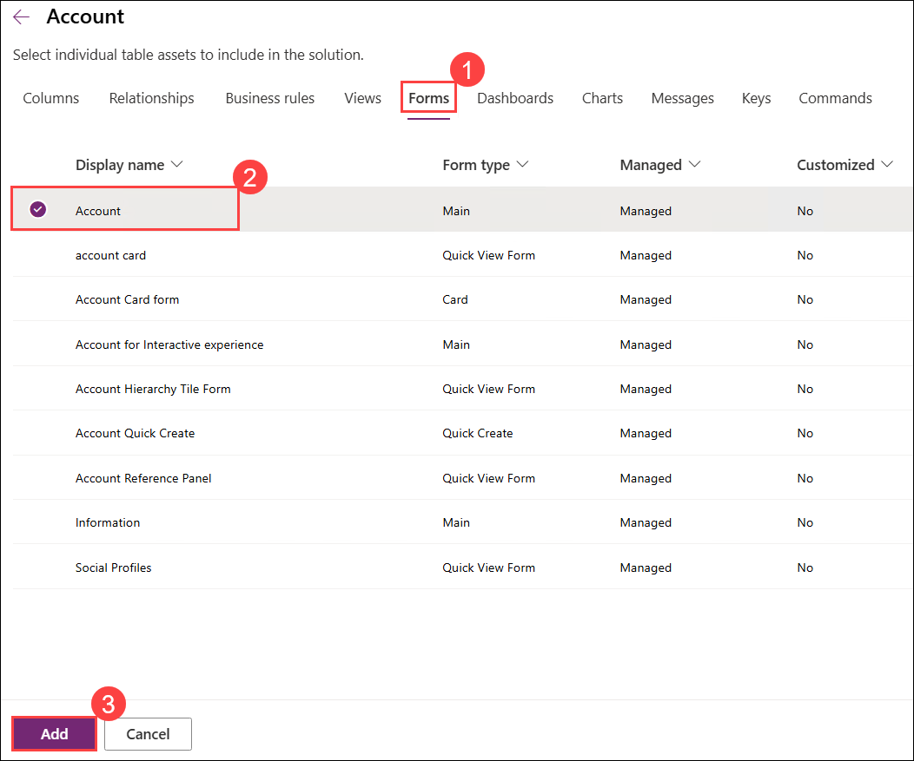

    > **Note:** You should have selected 1 view, 1 form, and 1 column for the Account table.

1. On the **Selected tables** window, select **Add**.

    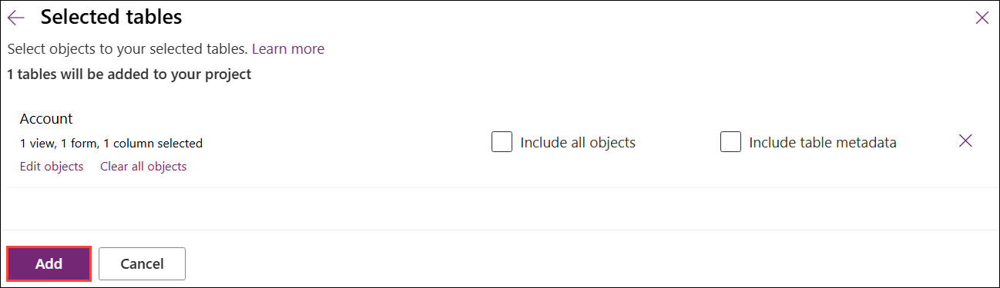

### Review
In this lab, you created publisher and solution and also added components to the solution.
