# Lab 1.5: Columns

## Scenario

You are a Power Platform functional consultant and have been assigned to the Fabrikam project for the next stage of the project.

In this practice lab, you will be modifying the properties of existing table columns and creating a new custom columns.

## Lab objectives
In this lab, you will perform:

+ Exercise 1: Modify and add columns on the Project table
+ Exercise 2: Modify and add columns on the Project Funding table
+ Exercise 3: Modify a lookup column on the Milestone table
+ Exercise 4: Add a Choice column
+ Exercise 5: Create columns on the Project Outcome table

## Exercise 1: Modify and add columns on the Project table

In this exercise, you will be changing properties on existing columns on the Project table in the Fabrikam Environmental solution, creating new columns, and adding an alternate key.

### Task 1.1: Modify properties on existing columns

1. Navigate to the Power Apps Maker portal `https://make.powerapps.com`

1. Make sure you are in your **PL Development** environment.

1. Select **Solutions**.

1. Open the **Fabrikam Environmental** solution. 

1. In the **Objects** pane on the left, expand **Tables**.

1. Select the **Project** table.

1. Under **Schema**, select **Columns**.

1. Select the **Project Description** column.

    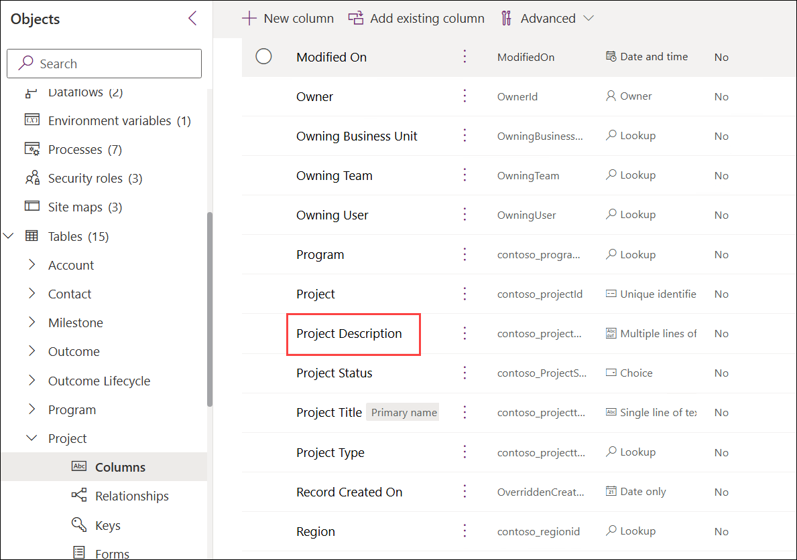

1. In the **Edit column** pane that appears on the right-hand side of the screen, expand **Advanced options** and scroll down.

1. Change the **Maximum character count (1)** to **10000**.

1. Select **Save (2)**.

    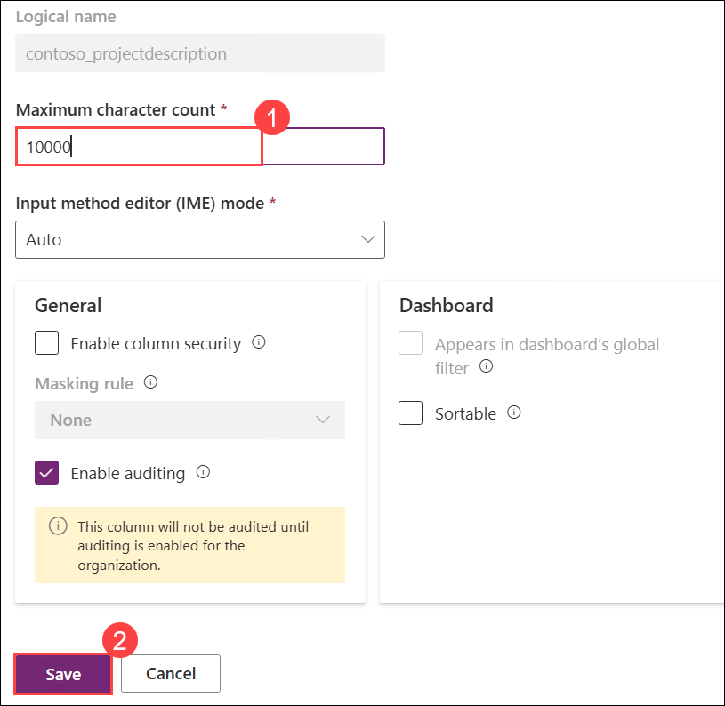

1. Select the **Project Status** column.

1. In the **Edit column** pane that appears on the right-hand side of the screen, change the **Required** drop-down to **Business required (1)**.

1. Expand **Advanced options (2)**.

1. Under Dashboard, check the **Appears in dashboard's global filter (3)** box.

1. Select **Save (4)**.

    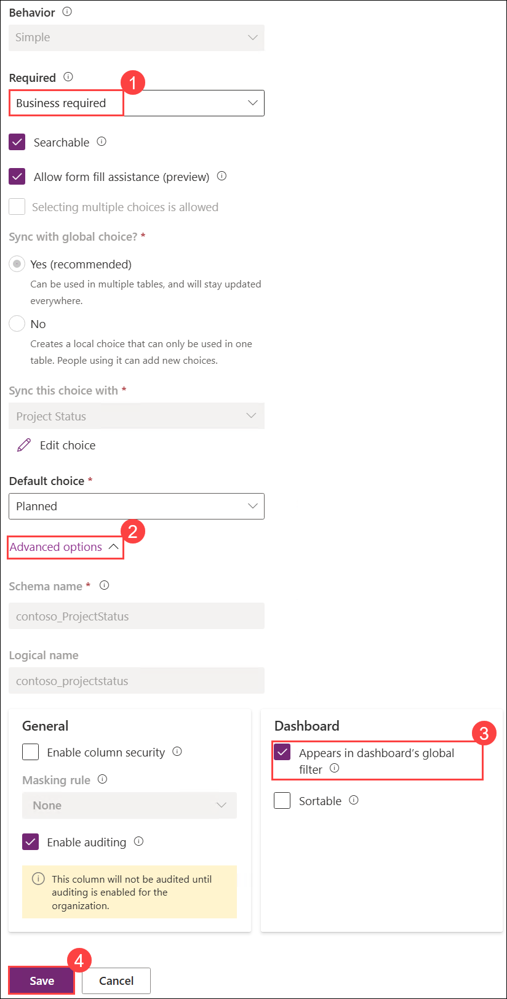

1. Select the **Project Type** column.

1. In the **Edit column** pane that appears on the right-hand side of the screen, expand **Advanced options**.

1. Check the **Appears in dashboard's global filter** box.

1. Select **Save**.

1. Select the **Estimated End** column.

1. In the **Edit column** pane that appears on the right-hand side of the screen, verify that the **Format** is **Date only**. 

1. Expand **Advanced options**.

1. Verify that the  **Time zone adjustment** is **User local**.

1. Under Dashboard, check the **Sortable** box.

1. Select **Save**.

### Task 1.2: Create an auto number column

1. Select **+ New column**.

    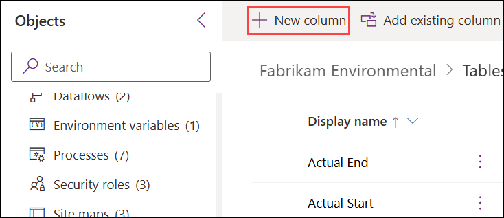

1. Enter `Project Code` for **Display Name (1)**.

1. Enter `Unique project reference` for **Description (2)**.

1. Select **Autonumber** in the **Data type (3)** drop-down.

1. Enter `PROJ` for **Prefix (4)**.

1. Select **Save (5)**.

    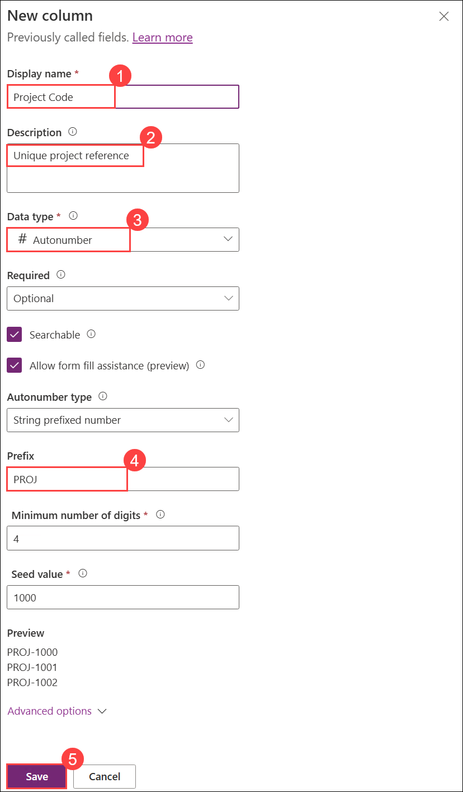

## Exercise 2: Modify and add columns on the Project Funding table

In this exercise, you will be changing properties on existing columns on the Project Funding table in the Fabrikam Environmental solution and adding a new column.

### Task 2.1: Modify value range on an existing column

1. Navigate to the Power Apps Maker portal `https://make.powerapps.com`

1. Make sure you are in the **PL Development** environment.

1. Select **Solutions**.

1. Open the **Fabrikam Environmental** solution.

1. In the **Objects** pane on the left, expand **Tables**.

1. Select the **Project Funding** table.

1. Under **Schema**, select **Columns**.

1. Select the **Funding Percentage** column.

1. In the **Edit column** pane that appears on the right-hand side of the screen, expand **Advanced options** and scroll down.

1. Change the **Minimum value** to `0`

1. Change the **Maximum value** to `100`

1. Select **Save**.

### Task 2.2: Create a currency column

1. Select **+ New column**.

1. Enter `Funding Amount` for **Display Name**.

1. Enter `Value of funding from the funder on the project` for **Description**.

1. Select **Currency** in the **Data type** drop-down.

1. Expand **Advanced options** and scroll down.

1. Change the **Minimum value** to `0`

1. Change the **Maximum value** to `99999999` (Eight 9s).

1. Select **Save**.

## Exercise 3: Modify a lookup column on the Milestone table

In this exercise, you will be changing properties on a lookup column on the Milestone table in the Fabrikam Environmental solution. Lookup columns when created by a relationship do not have auditing enabled by default.

### Task 3.1: Modify audit on lookup column

1. Navigate to the Power Apps Maker portal `https://make.powerapps.com`

1. Make sure you are in your **PL Development** environment.

1. Select **Solutions**.

1. Open the **Fabrikam Environmental** solution.

1. In the **Objects** pane on the left, expand **Tables**.

1. Select the **Milestone** table.

1. Under **Schema**, select **Columns**.

1. Select the **Project** column.

1. In the **Edit column** pane that appears on the right-hand side of the screen, change the **Required** drop-down to **Business required**. 

1. Expand **Advanced options** and scroll down.

1. Check the **Enable auditing** box.

1. Select **Save**.

## Exercise 4: Add a choice column

In this exercise, you will be creating a choice column to replace the use of status reasons on the Milestone and Outcome tables.

> **Note:** Status reasons cannot be changed in an editable grid.

### Task 4.1: Create choice

1. Navigate to the Power Apps Maker portal `https://make.powerapps.com`

1. Make sure you are in your **PL Development** environment.

1. Select **Solutions**.

1. Open the **Fabrikam Environmental** solution.

1. In the **Objects** pane on the left, select **Choices (1)**.

1. Select **+ New (2)**, select **More (3)**, and then select **Choice (4)**.

    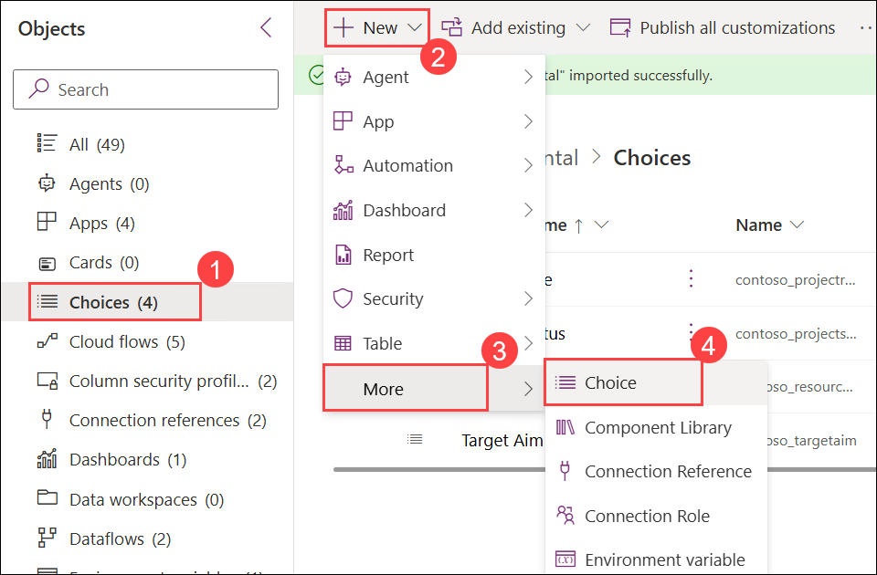

1. Enter `Environmental Status` for **Display Name (1)**.

1. Enter `Planned` for **Label (2)**.

1. Select **+ New choice**.

1. Enter `On Schedule` for **Label**.

1. Select **+ New choice**.

1. Enter `Delayed` for **Label**.

1. Select **+ New choice**.

1. Enter `Completed` for **Label**.

1. Select **+ New choice**.

1. Enter `Cancelled` for **Label**.

1. Select **Save (3)**.

    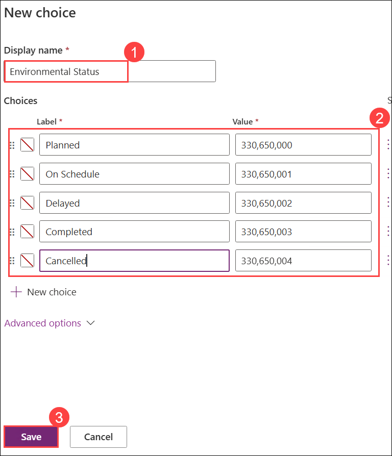

### Task 4.2: Add choice to Milestone table

1. In the **Objects** pane on the left, expand **Tables**.

1. Select the **Milestone** table.

1. Under **Schema**, select **Columns**.

1. Select **+ New column**.

1. Enter `Milestone Status` for **Display Name**.

1. Select **Choice** in the **Data type** drop-down and then select **Choice** again.

1. Select **Environmental Status** in the **Sync this choice with** drop-down.

1. Select **Planned** in the **Default choice** drop-down.

1. Select **Save**.

### Task 4.3: Add choice to Outcome table

1. In the **Objects** pane on the left, expand **Tables**.

1. Select the **Outcome** table.

1. Under **Schema**, select **Columns**.

1. Select **+ New column**.

1. Enter `Outcome Status` for **Display Name (1)**.

1. Select **Choice** in the **Data type** drop-down and then select **Choice (2)** again.

1. Select **Environmental status (3)** in the **Sync this choice with** drop-down.

1. Select **Planned (4)** in the **Default choice** drop-down.

1. Select **Save (5)**.

    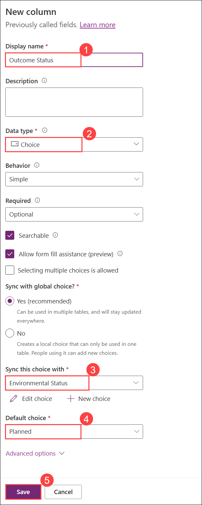

## Exercise 5: Create columns on the Project Outcome table

In this exercise, you will be creating columns on the Project Outcome custom table that you created in an earlier lab.

### Task 5.1: Create columns

1. Navigate to the Power Apps Maker portal `https://make.powerapps.com`

1. Make sure you are in your **PL Development** environment.

1. Select **Solutions**.

1. Open the **Fabrikam Environmental** solution.

1. In the **Objects** pane on the left, expand **Tables**.

1. Select the **Project Outcome** table.

1. Select **+ New**, and then select **Column**.

1. Enter `Stakeholders Notified` for **Display Name (1)**.

1. Select **Choice** in the **Data type** drop-down and then select **Yes/no (2)**.

1. Select **Save (3)**.

    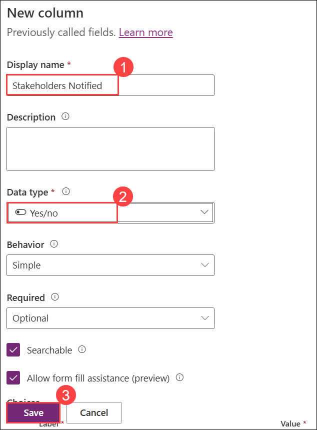

1. Select **+ New**, and then select **Column**.

1. Enter `Outcome Completed Date` for **Display Name**.

1. Select **Date and time** in the **Data type** drop-down and then select **Date only**.

1. Select **Save**.

1. Select **+ New**, and then select **Column**.

1. Enter `Comments` for **Display Name (1)**.

1. Select **Text** in the **Data type (2)** drop-down and then under **Multiple lines of text**, select **Plain text**.

1. Select the **Advanced options (3)**.

1. Enter the `comments` in the **Schema name (4)**.

1. Select **Save (5)**.

    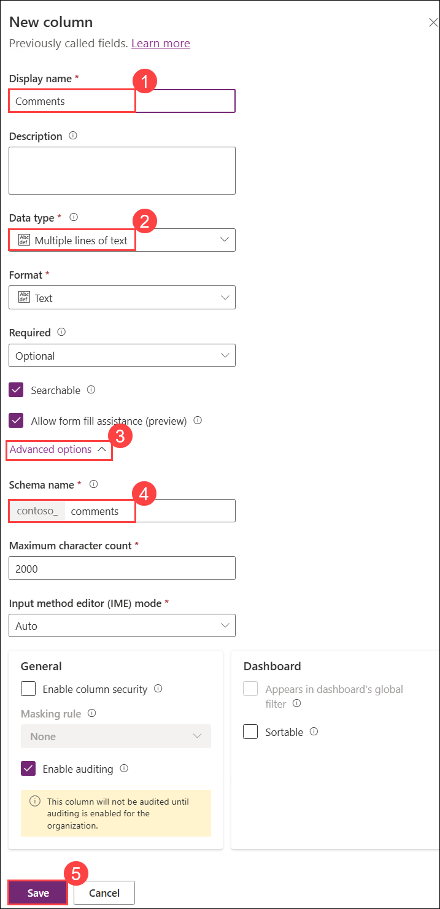

### Task 5.2: Publish changes

1. In the solution select the **Overview (1)** page.

1. Select **Publish all customizations (2)**.

    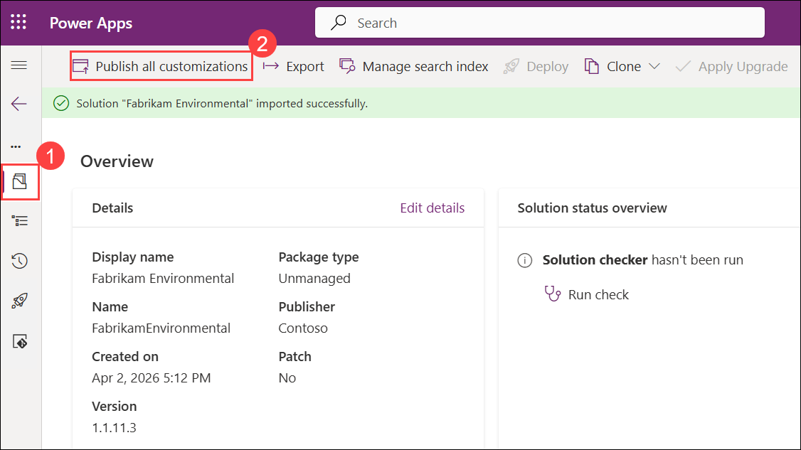

### Review
In this lab, you modified and added columns on the project and project funding table, modified a lookup coloumn on the milestone table, added a choice coloumn and created coloumns on the project outcome table.

