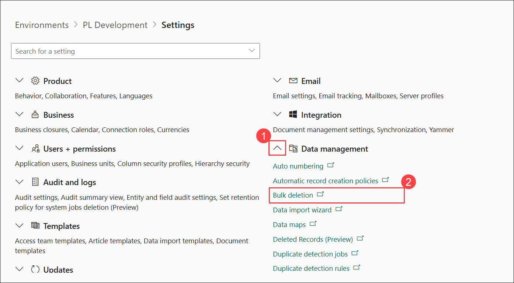
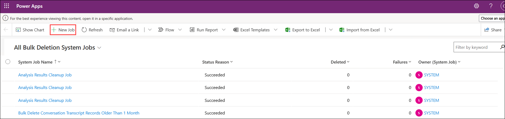
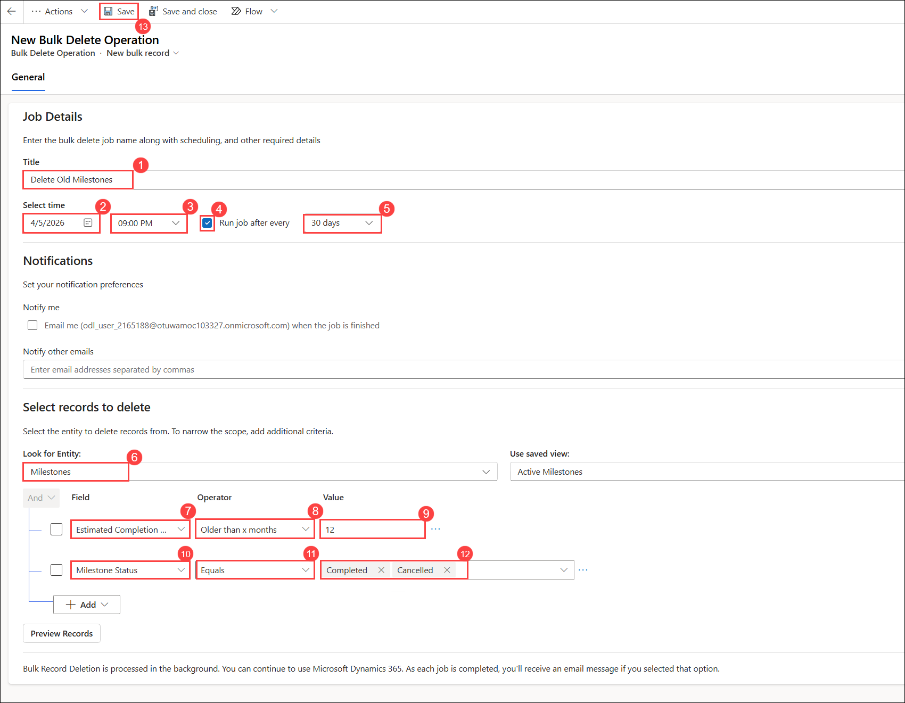
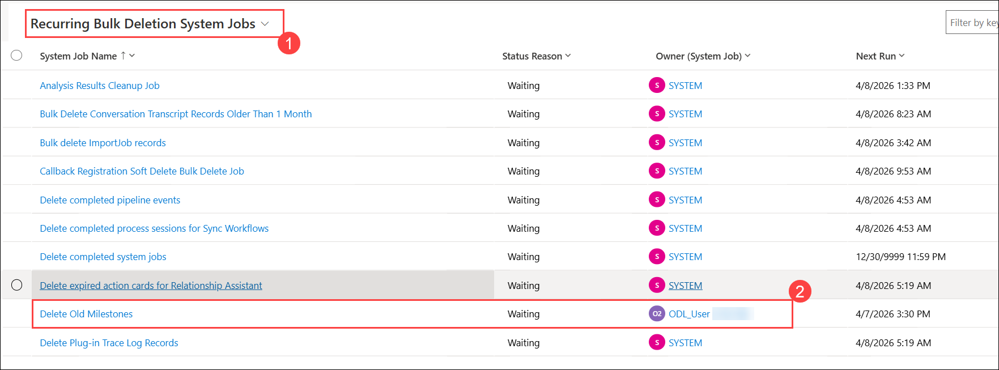

# Lab: Bulk delete data (Optional)

## Scenario

You are a Power Platform functional consultant and have been assigned to the Fabrikam project for the next stage of the project.

In this practice lab, you will be creating a recurring bulk deletion rule to automatically delete stale data.

## Lab objectives
In this lab, you will perform:

+ Exercise 1: Bulk Delete
  
## Exercise 1: Bulk Delete

In this exercise, you will create a bulk deletion operation that will delete all milestone rows with a completion date older than 12 months. You want this operation to run every month.

### Task 1.1: Create Bulk Delete Operation

1. Navigate to the Power Platform admin center `https://aka.ms/ppac`

1. Select **Manage** and then select **Environments** from the left navigation pane.

1. Select the **PL Development** environment.

1. Select **Settings**.

1. Expand **Data management (1)**.

1. Select **Bulk deletion (2)**.

    

1. Select **+ New Job**.

    

1. Enter `Delete Old Milestones` **(1)** for **Name**.

1. Select today’s date for **Date (2)** and select **9:00 PM** for **Time (3)**.

1. Check the **Run this job after every (4)** box.

1. Select **30 days (5)**.

1. Scroll down and select **Milestones** from the **Look for Entity (6)** drop-down.

1. Click **Select** and choose the **Estimated Completion Date (7)** column.

1. Select **Older than X Months (8)**.

1. Enter **12 (9)**.

1. Click on **+ Add**.

1. Click **Select** and choose the **Milestone status (10)** column.

1. Select **Equals (11)**.

1. Select **Completed** and **Cancelled** **(12)**.

1. Select **Save** **(13)**.

    

1. Select **Recurrin Bulk Deletion System Jobs (1)** and look for the bulk deletion job that you have created **(2)**.

    

    >**Note:** Wait for the job to be created. This can take few minutes. **Refresh** the view as needed.

### Review
In this lab, you created Bulk Delete Operation.

