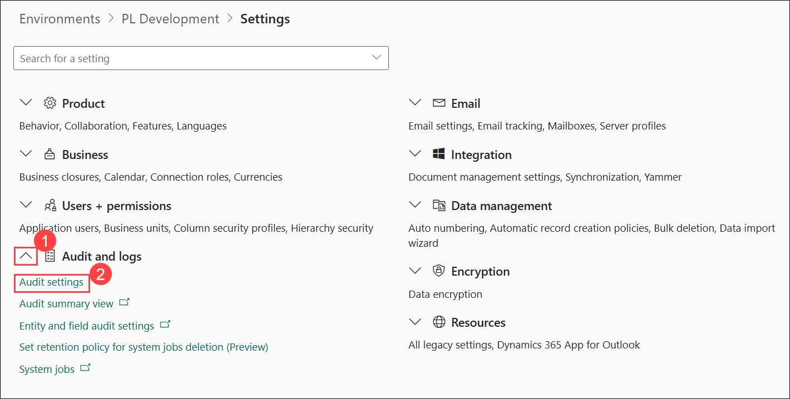
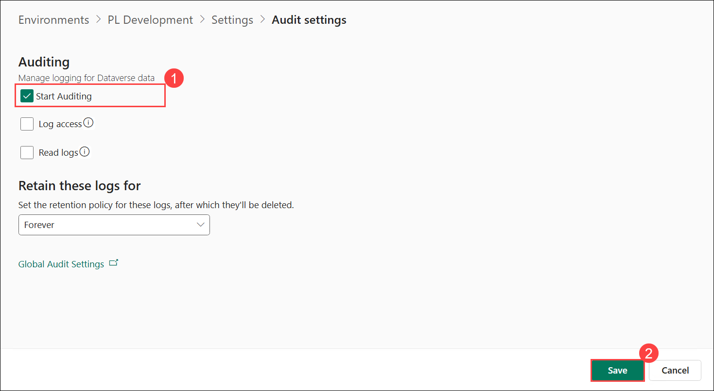
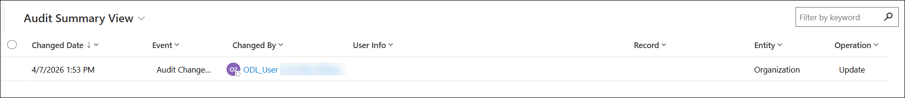

# Lab: Audit (Optional)

## Scenario

You are a Power Platform functional consultant and have been assigned to the Fabrikam project for the next stage of the project.

In this practice lab, you will enabling auditing to track data changes in Microsoft Dataverse.

## Lab objectives
In this lab, you will:

+ Task 1: Enable auditing

## Exercise 1: Enable auditing

In this exercise, you will enable auditing for your environment. In earlier labs you have enabled auditing for tables and columns.

### Task 1.1: Audit settings

1. Navigate to the Power Platform admin center `https://aka.ms/ppac`

1. Select **Manage** and then **Environments** from the left navigation pane.

1. Select the **PL Development** environment.

1. Select **Settings**.

1. Expand **Audit and logs (1)**.

1. Select **Audit settings (2)**.

    

1. Check the **Start Auditing (1)** box.

1. Select **Save (2)**.

    

1. Select **Settings** in the breadcrumb at the top of the screen.

1. Expand **Audit and logs**.

1. Select **Audit summary view** to view the audited operations so far.

    !

### Review
In this lab, you activated auditing to monitor and record data modifications within Microsoft Dataverse.

