# Lab 3.1: Forms

## Scenario

You are a Power Platform functional consultant and have been assigned to the Fabrikam project for the next stage of the project.

In this practice lab, you will be modifying the forms for the Fabrikam Environment model-driven apps.

There are three model-driven apps in the solution:

- Environmental Administration
- Environmental Management
- Environmental Project Delivery

## Lab objectives
In this lab, you will perform:

+ Exercise 1: Edit Project forms
+ Exercise 2: Edit Program form
+ Exercise 3: Edit Program Funding form
+ Exercise 4: Edit Region form
+ Exercise 5: Create a Quick Create form
+ Exercise 6: Edit Milestone form
+ Exercise 7: Edit Outcome form
+ Exercise 8: Edit Project Outcome form
+ Exercise 9: Copy Outcome form
+ Exercise 10: Modify model-driven apps

## Exercise 1 – Edit Project forms

In this exercise, you will make changes to the forms for the Project table.

### Task 1.1 – Modify the Project main form

In this task, you will perform the following changes to the form:

- Change the label for project description
- Increase the size of project description field
- Add columns to the form

1. Navigate to the Power Apps Maker portal `https://make.powerapps.com`

1. Make sure you are in your **PL Development** environment.

1. Select **Solutions**.

1. Open the **Fabrikam Environmental** solution.

1. In the **Objects** pane on the left, expand **Tables**.

1. Select the **Project (1)** table.

1. Under **Data experiences**, select **Forms (2)**.

   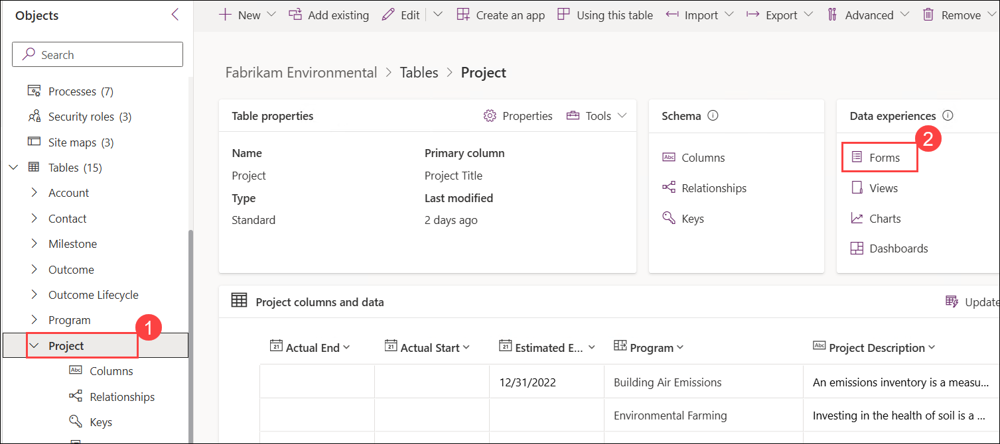

1. Select the **Information** form where the **Form type** is **Main**, select the **Commands (1)** menu **(⋮)**, and select **Edit (2)** > **Edit in new tab (3)**.

   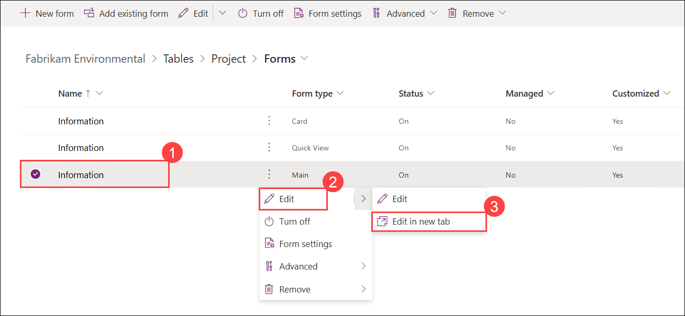

1. Select the **Project Description** field.

1. In the **Properties** pane on the right-hand side, change **Label** to `Description`

1. In the **Properties** pane on the right-hand side, increase **Form field height** to **4 rows**.

1. Select **Table columns** on the left-hand side of the form designer.

1. Drag the **Project Code (1)** column into the **Header** area.

1. Drag the **Project Summary (2)** column below **Program**.

1. Drag the **Project Lead (3)** column below **Region**.

1. Drag the **Length of Project (4)** column below **Scheduled End** in the **Dates** section.

   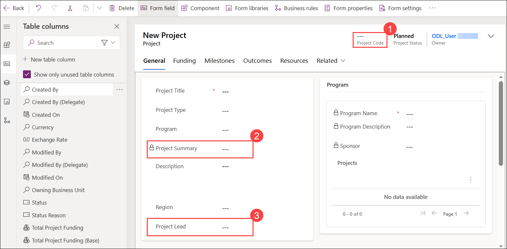

   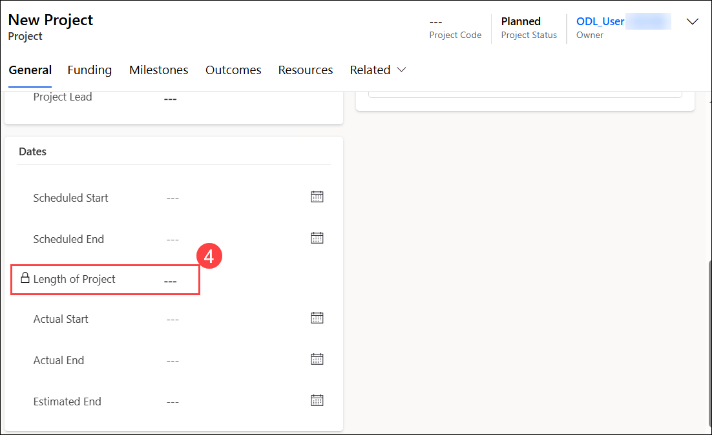

1. Select the **Funding (1)** tab.

1. Drag the **Total Project Funding (2)** column above the **Project Funding** sub-grid.

1. On the **Save and publish (3)** drop-down menu, select **Save only (4)**. Do not navigate away from this page.

   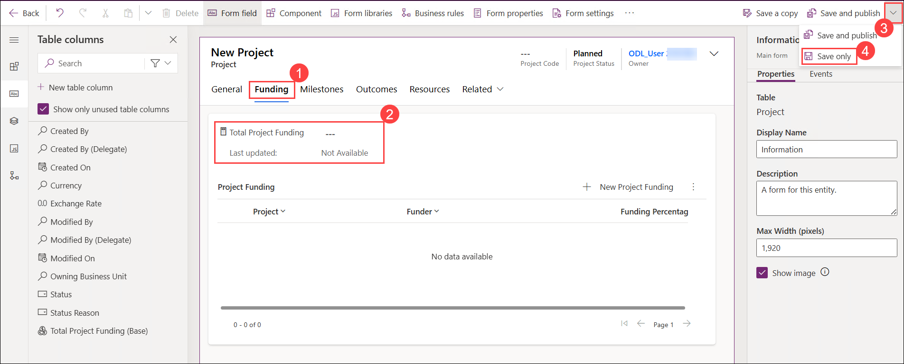

### Task 1.2 – Add Timeline control to main form

In this task, you will perform the following changes to the form:

- Change tab properties
- Insert the Timeline control
- Restrict the activities available on the Timeline

1. Select **Tree view (1)** on the left-hand side of the form designer.

1. Select the **General (2)** tab.

1. In the **Properties** pane on the right-hand side, select **3 columns (3)** in the **Layout** drop-down.

   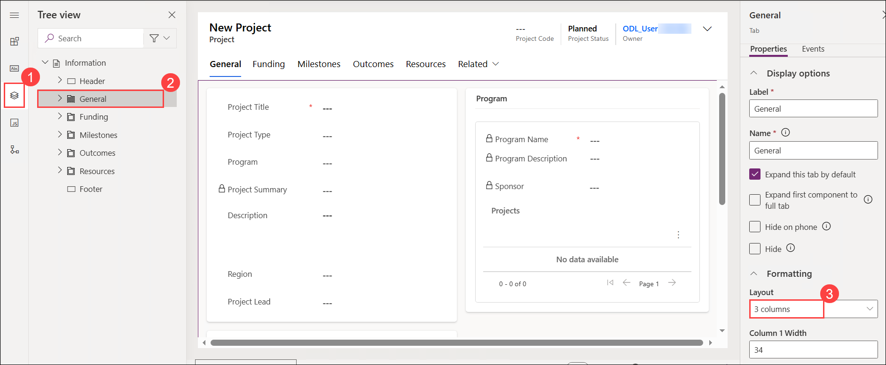

1. Select the **Program** section and drag to the new right-hand column of the **General** tab.

   .png)

   > **Note:** If you don't see a three column layout, change the forms view size to **Desktop**.

      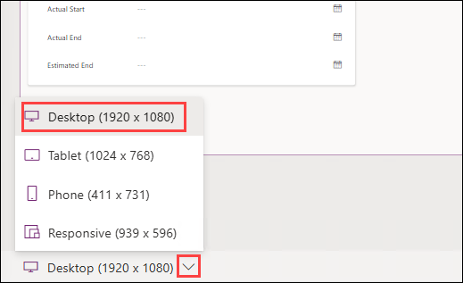

1. Select the **New section (1)** in the right column and select **Delete (2)**.

   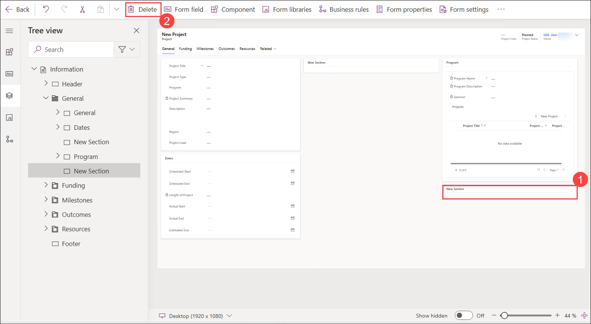

1. Select the **New section (1)** in the middle column.

1. Select **Components (2)** on the left navigation of the form designer.

   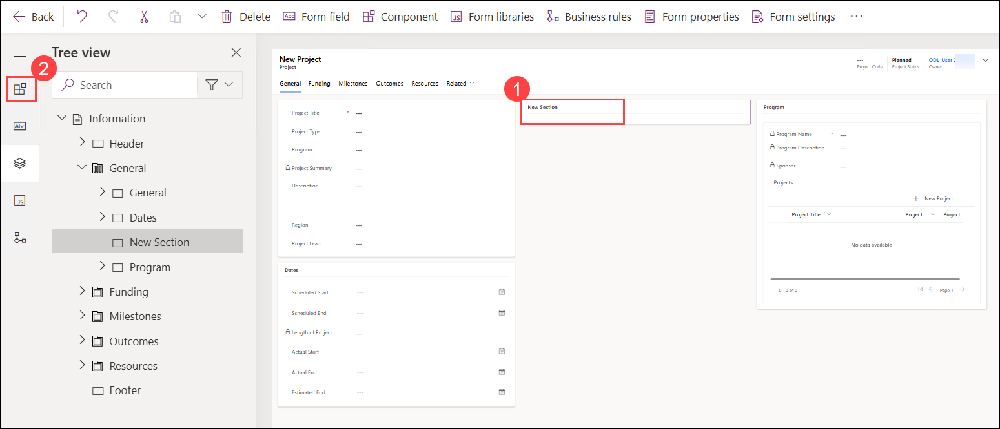

1. Expand **Display**.

1. Drag the **Timeline** control to the middle column of the **General** tab.

1. Select **Tree view** on the left side of the form designer, expand **General** tab, and select the **New Section**.

1. In the **Properties** pane on the right side, enter `Timeline` for both **Label (1)** and **Name (2)**.

1. Check the **Hide label (3)** box.

   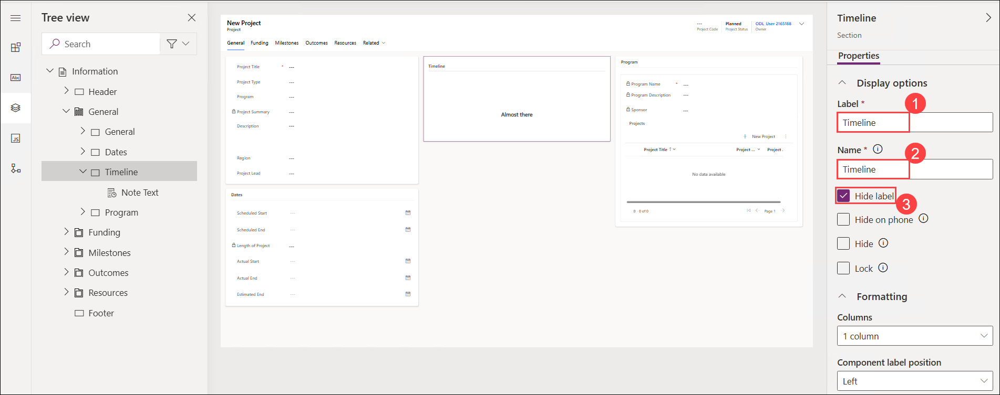

1. In the **Tree view**, select the **Note Text** control for the Timeline.

1. In the **Properties** pane on the right side, select **Fax**, verify the **Enable** box is unchecked, and select **Cancel**.

1. In the **Properties** pane on the right side, select **Social Activity**, uncheck the **Enable** box, and select **Done**.

1. In the **Properties** pane on the right side, select **Date Created** in **Sort activities by** drop-down.

1. On the **Save and publish** drop-down menu, select **Save only**. Do not navigate away from this page.

### Task 1.3 – Outcome sub-grid on main form

In this task, you will perform the following changes to the form:

- Replace the sub-grid for the many-to-many relationship between Project and Outcome with a sub-grid for the Project Outcome table

1. Select the **Outcomes (1)** tab.

1. Select the **Outcomes SubGrid (2)**.

1. In the properties pane on the right-hand side, select **Project Outcomes (Project)** in the **Table (3)** drop-down.

1. On the **Save and publish (4)** drop-down menu, select **Save only (5)**.

   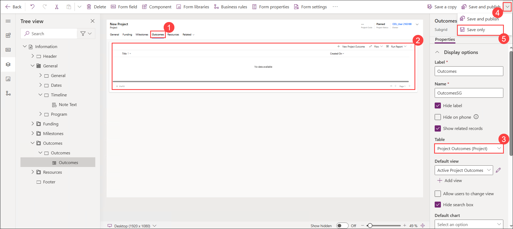

1. **Close** the form designer.

1. Select **Done**.

### Task 1.4 – Modify the Project quick view form

In this task, you will perform the following changes to the form:

- Add a sub-grid of Outcomes to the quick view form

1. Select the **Information** form where the **Form type** is **Quick View**, select the **Commands** menu  **(⋮)**, and select **Edit** > **Edit in new tab**.

1. Select **Table columns** on the left-hand side of the form designer.

1. Drag the **Region** column below **Owner**.

1. Drag the **Project Type** column below **Region**.

1. Select the **Project Status** column to add it to the form below **Project Type**.

1. Select the **Owner** field.

1. In the **Properties** pane on the right side, check the **Hide** box.

1. Select **Components** on the left side of the form designer.

1. Select the **1-column section** control to add it to the form.

1. In the properties pane on the right-hand side, enter `Outcomes` for **Label** and **Name**.

1. Expand **Grid (1)** in the **Components** pane.

1. Select **Subgrid (2)** and check **Show related records (3)**.

1. Select **Outcomes (4)** for **Table**.

1. Select **Outcomes SubGrid (5)** for **Default view**.

1. Select **Done (6)**.

   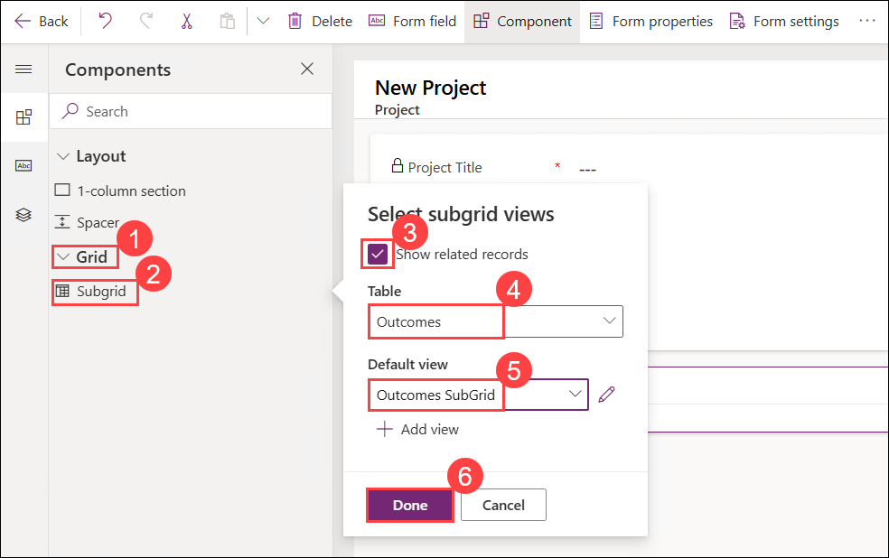

1. In the **Properties** pane on the right side, enter `Outcomes` for **Label (1)** and `OutcomesSG` for **Name (2)**.

1. Check **Hide Label (3)**

1. On the **Save and publish (4)** drop-down menu, select **Save only (5)**.

   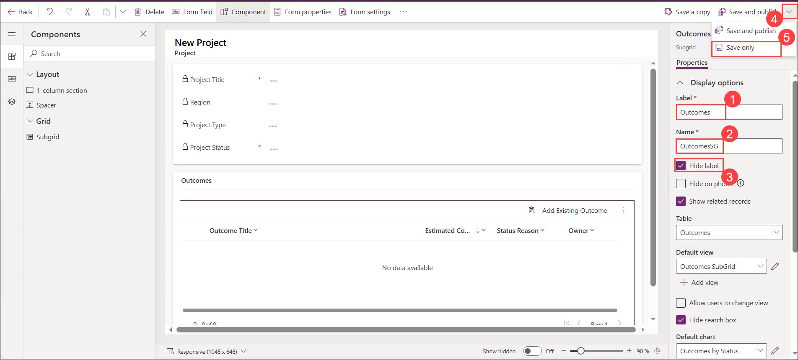

1. **Close** the form designer.

1. Select **Done**.

## Exercise 2 – Edit Program form

In this exercise, you will add filtering on a lookup field on the Program table form.

### Task 2.1 – Add filtering to lookup

In this task, you will perform the following changes to the form:

- Add a filter to the Contact lookup to only show Contacts that belong to the selected Account

1. Navigate to the Power Apps Maker portal `https://make.powerapps.com`.

1. Make sure you are in the **PL Development** environment.

1. Select **Solutions**.

1. Open the **Fabrikam Environmental** solution.

1. In the **Objects** pane on the left, click and expand **Tables**.

1. Select the **Program** table.

1. Under **Data experiences**, click on **Forms**.

1. Select the **Information (1)** form where the **Form type** is **Main**, select the **Commands (2)** menu **(⋮)**, and select **Edit (3)** > **Edit in new tab (4)**.

   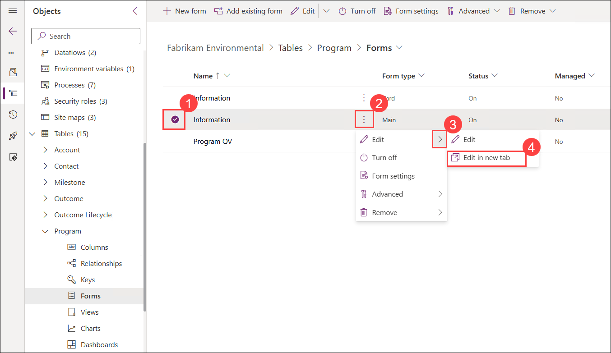

1. Select the **Sponsor Main contact (1)** field.

1. In the **Properties** pane on the right-hand side, expand **Filtering (2)**.

1. Check the **Filter by related rows (3)** box.

1. Select **Sponsor (Programs) (4)** for **Relationship to current table**.

1. Select **Company name (Contacts) (5)** for **Relationship to this lookup's table.**

1. On the **Save and publish (6)** drop-down menu, select **Save only (7)**. 

   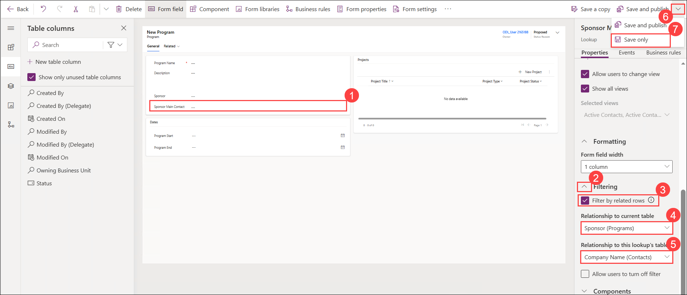

1. **Close** the form designer.

1. Select **Done**.

## Exercise 3 – Edit Program Funding form

In this exercise, you will add new columns to the Project Funding table form.

### Task 3.1 – Add columns to form

In this task, you will perform the following changes to the form:

- Add columns to the form

1. Navigate to the Power Apps Maker portal `https://make.powerapps.com`.

1. Make sure you are in the **PL Development** environment.

1. Select **Solutions**.

1. Open the **Fabrikam Environmental** solution.

1. In the **Objects** pane on the left, expand **Tables**.

1. Select the **Project Funding** table.

1. Under **Data experiences**, select **Forms**.

1. Select the **Information** form where the **Form type** is **Main**, select the **Commands** menu **(⋮)**, and select **Edit** > **Edit in new tab**.

1. Select **Table columns** on the left-hand side of the form designer.

1. Drag the **Currency** column below **Funding Percentage**.

1. Select the **Funding amount** column to add to the form below **Currency**.

   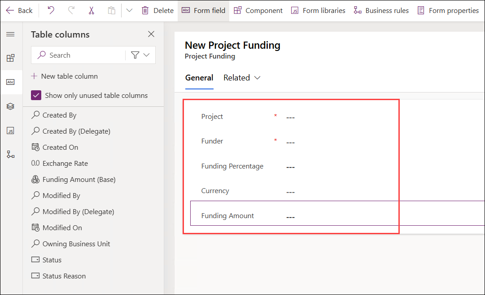

1. On the **Save and publish** drop-down menu, select **Save only**. 

1. **Close** the form designer.

1. Select **Done**.

### Task 3.2 – Add form control

In this task, you will perform the following changes to the form:

- add form component to embed the account form

1. Navigate to the Power Apps Maker portal `https://make.powerapps.com`.

1. Make sure you are in the **PL Development** environment.

1. Select **Solutions**.

1. Open the **Fabrikam Environmental** solution.

1. In the **Objects** pane on the left, expand **Tables**.

1. Select the **Project Funding** table.

1. Under **Data experiences**, select **Forms**.

1. Select the **Information** form where the **Form type** is **Main**, select the **Commands** menu **(⋮)**, and select **Edit** > **Edit in new tab**.

1. Select **Tree view** on the left-hand side of the form designer.

1. Select the **General** tab.

1. In the **Properties** pane on the right-hand side, select **2 columns** in the **Layout** drop-down.

1. Select **Components** on the left navigation of the form designer.

1. Expand **Display**.

1. Drag the **Form** control to the right-hand column of the **General** tab.

1. Select **Funder (1)** for **Lookup column**.

1. Select **Account main form for Environmental (2)** for **Related Form**.

1. Select **Done (3)**.

   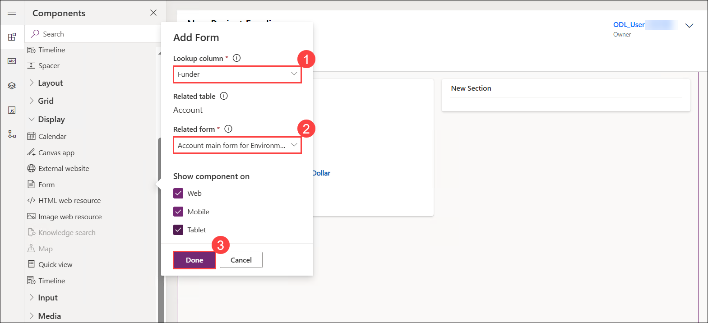

1. Select the **New Section (1)**

1. Check the **Hide label (2)** box.

1. On the **Save and publish (3)** drop-down menu, select **Save only (4)**.

   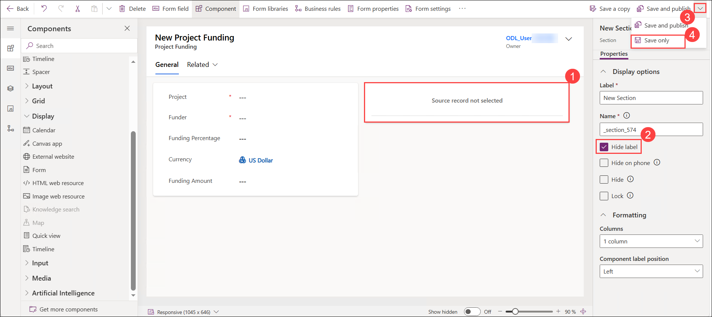

1. **Close** the form designer.

1. Select **Done**.

## Exercise 4 – Edit Region form

In this exercise, you will add the hierarchical relationship to the Region table form.

### Task 4.1 – Add parent lookup and child sub-grid to the form

In this task, you will perform the following changes to the form:

- Add parent region lookup
- Add a sub-grid for child regions

1. Navigate to the Power Apps Maker portal `https://make.powerapps.com`

1. Make sure you are in the **PL Development** environment.

1. Select **Solutions**.

1. Open the **Fabrikam Environmental** solution.

1. In the **Objects** pane on the left, expand **Tables**.

1. Select the **Region** table.

1. Under **Data experiences**, select **Forms**.

1. Select the **Information** form where the **Form type** is **Main**, select the **Commands** menu **(⋮)**, and select **Edit** > **Edit in new tab**.

1. Select **Table columns** on the left navigation of the form designer.

1. Drag the **Parent Region** column below **Region Name**.

1. Select **Components** on the left navigation of the form designer.

1. Select the **1-column section** control to add it to the form.

1. In the **Properties** pane on the right side, enter `Sub Regions` for **Label** and `ChildRegions` for **Name**.

1. Expand **Grid** in the **Components** pane.

1. Select **Subgrid** and check **Show related records**.

1. Select **Regions (Parent Region)** for **Table**.

1. Select **Done**.

1. In the **Properties** pane on the right side, enter `Sub Regions` for **Label (1)** and `ChildRegionsSG` for **Name (2)**.

1. Check the **Hide label (3)** box.

1. On the **Save and publish (4)** drop-down menu, select **Save only (5)**.

   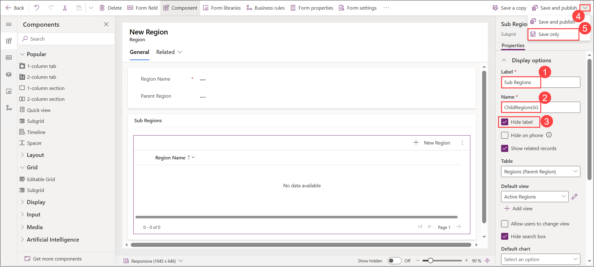

1. **Close** the form designer.

1. Select **Done**.

## Exercise 5 – Project Resource Quick Create form

In this exercise, you will create a Quick Create form for the Project Resource table form.

### Task 5.1 – Enable Quick Create form

In this task, you will enable the Project Resource table for quick create.

1. Navigate to the Power Apps Maker portal `https://make.powerapps.com`

1. Make sure you are in the **PL Development** environment.

1. Select **Solutions**.

1. Open the **Fabrikam Environmental** solution.

1. In the **Objects** pane on the left, expand **Tables**.

1. Select the **Project Resource (1)** table.

1. Under **Table Properties**, select **Properties (2)**.

1. In the **Edit table** pane on the right side of the screen, expand **Advanced options** and scroll down.

1. Check the **Leverage quick-create form if available (3)** box.

1. Select **Save (4)**.

   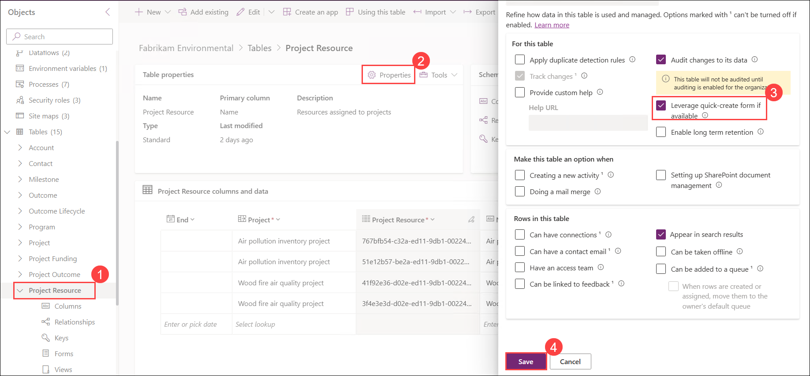

### Task 5.2 – Create Quick Create form

In this task, you will create a quick create form.

1. In the **Project Resource** table, under **Data experiences**, select **Forms**.

1. Select **+ New form (1)**.

2. Select **Quick create form (2)**.

1. Enter  `Project Resource Quick Create` for **Form name (3)**.

1. Uncheck **Get AI-generated column suggestions (4)** and select **Create (5)**.

   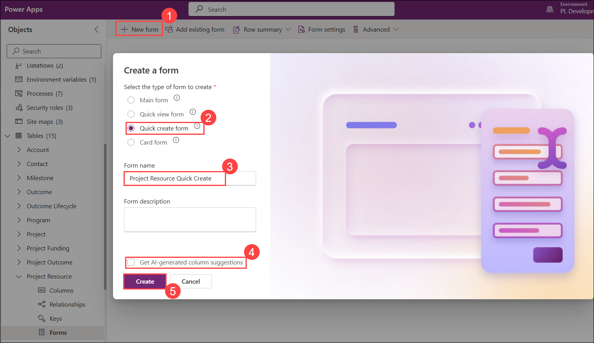

1. Drag the **Project** column to add to the form in the first section.

1. Drag the **Resource** column to add to the form in the first section.

1. Drag the **Project Role** column to add to the form in the second section.

1. Drag the **Start** column to add to the form in the third section.

1. Drag the **End** column to add to the form in the third section.

1. Select the first section, and in the properties pane click **Hide label**.

1. Select the second section, and in the properties pane click **Hide label**.

1. Select the third section, and in the properties pane click **Hide label**.

   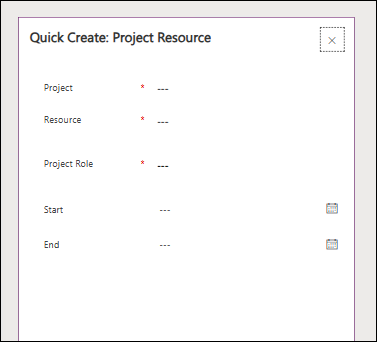

1. On the **Save and publish** drop-down menu, select **Save only**.

1. Select **🡠 Back**.

## Exercise 6 – Edit Milestone form

In this exercise, you will add the status choice column to to the Milestone table form.

### Task 6.1 – Add columns to the form

In this task, you will perform the following changes to the form:

- Add Milestone status to the form
- Remove Status reason from the form

1. Navigate to the Power Apps Maker portal `https://make.powerapps.com`

1. Make sure you are in the **PL Development** environment.

1. Select **Solutions**.

1. Open the **Fabrikam Environmental** solution.

1. In the **Objects** pane on the left, expand **Tables**.

1. Select the **Milestone** table.

1. Under **Data experiences**, select **Forms**.

1. Select the **Information** form where the **Form type** is **Main**, select the **Commands** menu **(⋮)**, and select **Edit** > **Edit in new tab**.

1. Drag the **Milestone Status** column below the **Status Reason** field.

1. Select the **Status Reason** field and select **Delete**.

   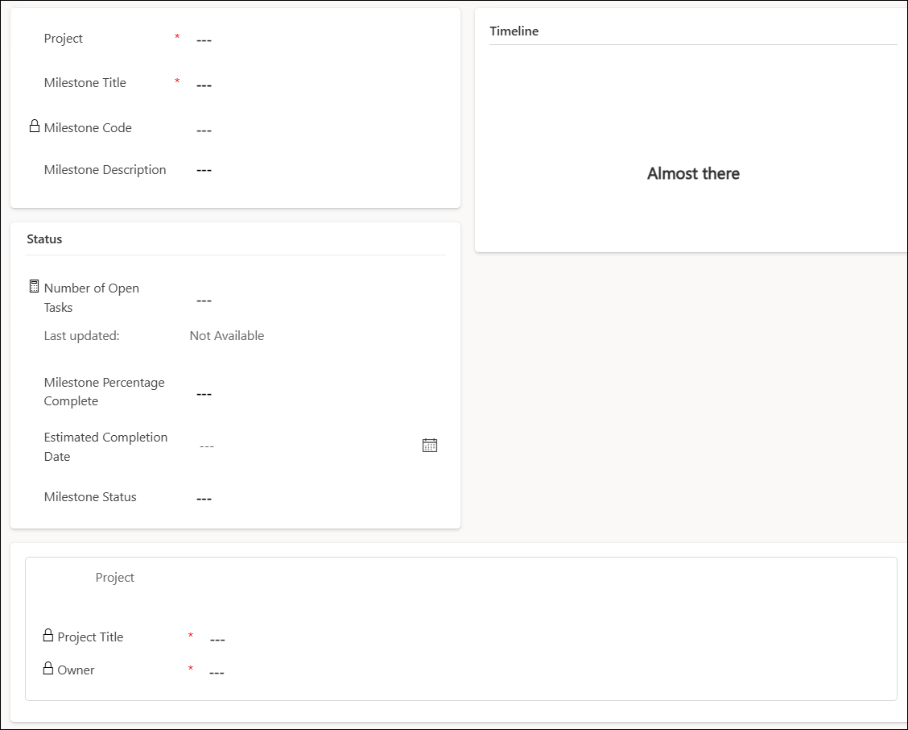

1. On the **Save and publish** drop-down menu, select **Save only**.

1. **Close** the form designer.

1. Select **Done**.

## Exercise 7 – Edit Outcome form

In this exercise, you will add the status choice column to to the Outcome table form.

### Task 7.1 – Add columns to the form

In this task, you will perform the following changes to the Outcome form:

- Add Outcome status to the form
- Remove Status reason from the form
- Delete the Project tab

1. Navigate to the Power Apps Maker portal `https://make.powerapps.com`

1. Make sure you are in the **PL Development** environment.

1. Select **Solutions**.

1. Open the **Fabrikam Environmental** solution.

1. In the **Objects** pane on the left, expand **Tables**.

1. Select the **Outcome** table.

1. Under **Data experiences**, select **Forms**.

1. Select the **Information** form where the **Form type** is **Main**, select the **Commands** menu (⋮), and select **Edit** > **Edit in new tab**.

1. Drag the **Outcome Status** column below the **Status Reason** field.

1. Select the **Status Reason** field and select **Delete**.

   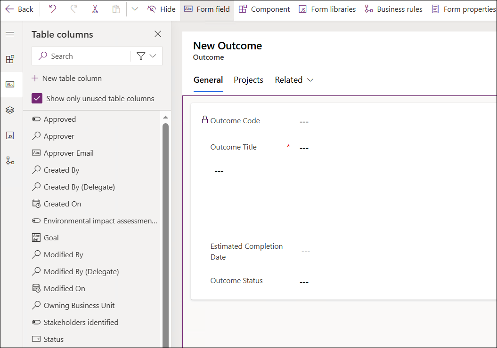

1. Select the **Projects (1)** tab and select the **Delete (2)** icon.

   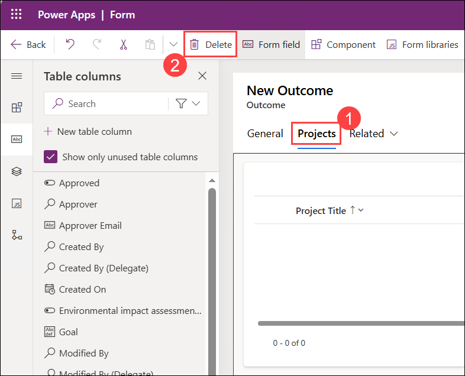

1. On the **Save and publish** drop-down menu, select **Save only**.

1. **Close** the form designer.

1. Select **Done**.

## Exercise 8 – Edit Project Outcome form

In this exercise, you will configure the default form for the Project Outcome table.

### Task 8.1 – Configure main form

In this task, you will perform the following changes to the Project Outcome form:

- Change for layout
- Add columns to the form
- Hide the name on the form
- Add a quick view form

1. Navigate to the Power Apps Maker portal `https://make.powerapps.com`

1. Make sure you are in the **PL Development** environment.

1. Select **Solutions**.

1. Open the **Fabrikam Environmental** solution.

1. In the **Objects** pane on the left, expand **Tables**.

1. Select the **Project Outcome** table.

1. Under **Data experiences**, select **Forms**.

1. Select the **Information** form where the **Form type** is **Main**, select the **Commands** menu **(⋮)**, and select **Edit** > **Edit in new tab**.

1. Drag the **Owner** field from the body into the **Header**.

1. Select **Tree view** on the left side of the form designer.

1. Select the **General** tab.

1. In the **Properties** pane on the right side, enter `General` for **Name**

1. Under **Formatting**, in the **Layout** drop-down, select **2 columns**.

1. Select the **New Section** section.

1. In the properties pane on the right-hand side, enter `Related` for **Label** and **Name**.

1. Select **Table columns** on the left-hand side of the form designer.

1. Drag the **Project** column below the **Title** field.

1. Select the **Outcome** column to add to the form below **Project**.

1. Select the **Comments** column to add to the form below **Outcome**.

1. Select the **Outcome Completed Date** column to add to the form below **Comments**.

1. Select the **Stakeholders Notified** column to add to the form below **Outcome completed date**.

1. Select the **Title** field.

1. In the **Properties** pane on the right side, check **Hide**.

1. Select the **Related** section.

1. Select **Components** on the left side of the form designer, and expand **Display**.

1. Select the **Quick view** control.

1. In the **Select Quick view forms** pop-up, select **Project** for **Lookup**.

1. Select **Information** for **Project**.

1. Select **Done**.

   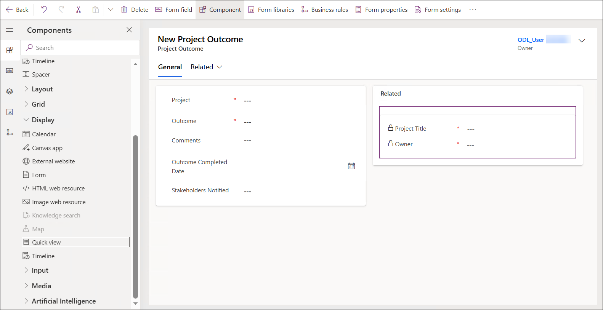

1. Select the **Related** section.

1. Check **Hide label**.

1. On the **Save and publish** drop-down menu, select **Save only**.

1. **Close** the form designer.

1. Select **Done**.

## Exercise 9 – Copy Outcome form

In this exercise, you will be copying a form and implementing security on forms.

### Task 9.1 – Copy Outcome form

In this task, you will perform the following changes to the form:

- Rename the main form
- Copy the main form to allow managers to view and edit columns
- Associate security roles with the forms
- Set the form order

1. Navigate to the Power Apps Maker portal `https://make.powerapps.com`

1. Make sure you are in the **PL Development** environment.

1. Select **Solutions**.

1. Open the **Fabrikam Environmental** solution.

1. In the **Objects** pane on the left, expand **Tables**.

1. Select the **Outcome** table.

1. Under **Data experiences**, select **Forms**.

1. Select the **Information** form where the **Form type** is **Main**, select the **Commands** menu **(⋮)**, and select **Edit** > **Edit in new tab**.

1. In the **Properties** pane on the right side, enter `User` for **Display Name**.

1. On the **Save and publish** drop-down menu, select **Save only**.

1. Select **Save a copy (1)**.

1. Enter `Manager` for **Display Name (2)** and `Form for managers` for **Description (3)** and select **Save (4)**.

   .png)

1. Select **Tree view** on the left side of the form designer.

1. Select the **General** tab.

1. In the properties pane on the right-hand side, enter `General` for **Name**

1. Under **Formatting**, in the **Layout** drop-down, select **2 columns**.

1. Select the **New Section** section.

1. In the **Properties** pane on the right side, enter `Details` for **Label** and **Name**.

1. Select **Table columns** on the left navigation of the form designer.

1. Drag the **Goal** column to the **Details** section.

1. Select **Approver** to add to the **Details** section.

1. Select **Approver Email** to add to the **Details** section.

1. Select **Approved** to add to the **Details** section.

1. Select **Target Aim** to add to the **Details** section.

1. Select **Stakeholders identified** to add to the **Details** section.

1. Click on **Tasks created** to add to the **Details** section.

1. Click on **Tasks assigned** to add to the **Details** section.

1. Click on **Tasks completed** to add to the **Details** section.

1. Click on **Environmental impact assessment completed** to add to the Details section.

1. Select the **Details** section.

1. Check **Hide label**.

    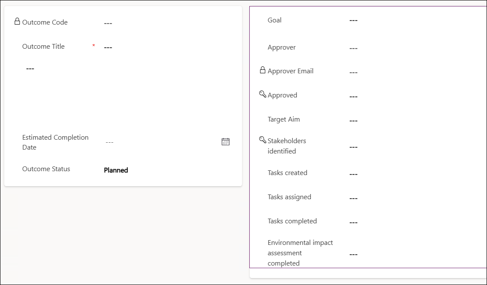

1. On the **Save and publish** drop-down menu, select **Save only**.

1. Select **Form settings (1)**.

1. Select **Specific security role (2)**.

1. Select the **Environmental manager** and **Environmental administrator** roles **(3)** as the specific security roles that should have access to this form.

1. Select the **Form order (4)** tab.

   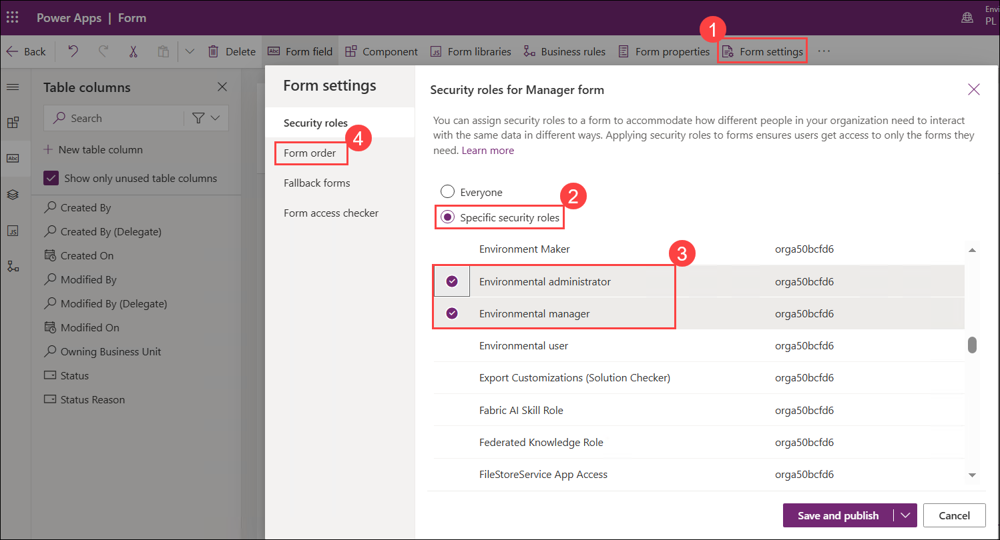

1. Drag **Manager** above **User**.

   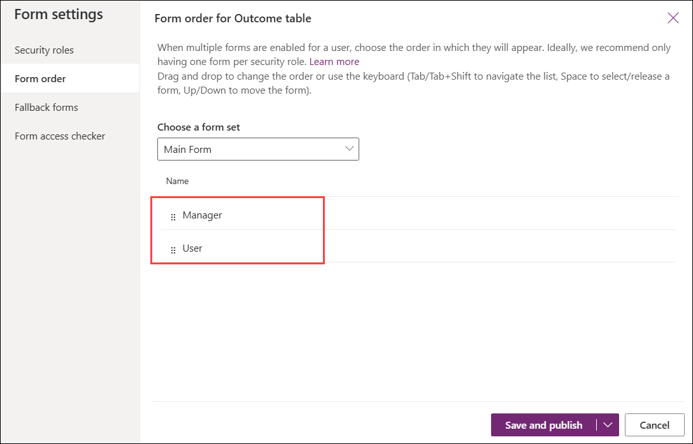

1. Select the **Fallback forms (1)** tab.

1. Uncheck **Enable Manager form as a Fallback form (2)**.

1. Select **Save and publish (3)**.

   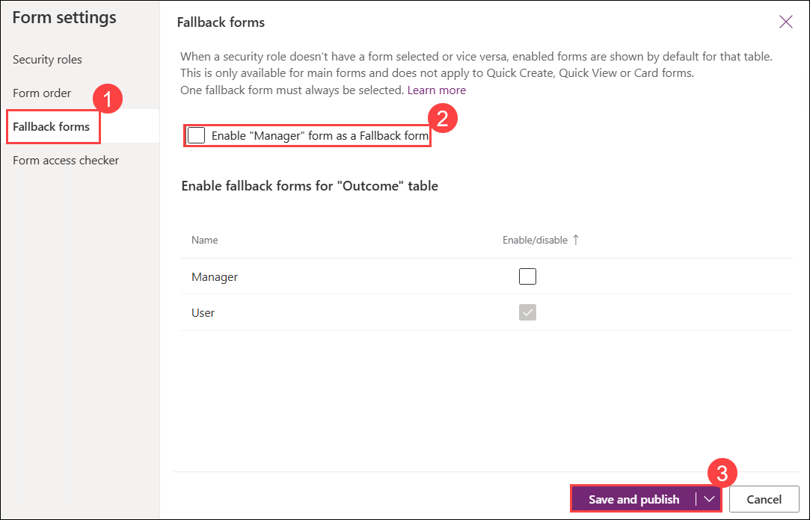

1. **Close** the form designer.

1. Select **Done**.

1. Select the **User** form.

1. Select **Form settings** from the command bar.

1. Select the **Specific security roles** radio button.

1. Select the **Environmental user** role.

1. Select **Save and publish**.

### Task 9.2 – Publish changes

1. In the **Objects** pane on the left, select **All**.

1. Select **Publish all customizations**.

## Exercise 10 – Modify model-driven apps

In this exercise, you will be adding the tables and forms to the Fabrikam model-driven apps.

### Task 10.1 – Environmental Management app

In this task, you will perform the following changes to the app:

- Add Project Outcome table
- Use the Manager form

1. Navigate to the Power Apps Maker portal `https://make.powerapps.com`

1. Make sure you are in the **PL Development** environment.

1. Open the **Fabrikam Environmental** solution.

1. In the **Objects** pane on the left, expand **Apps (1)**.

1. Select the **Environmental Management** app, select the **Commands** menu **(⋮) (2)**, and select **Edit (3)** > **Edit in new tab (4)**.

   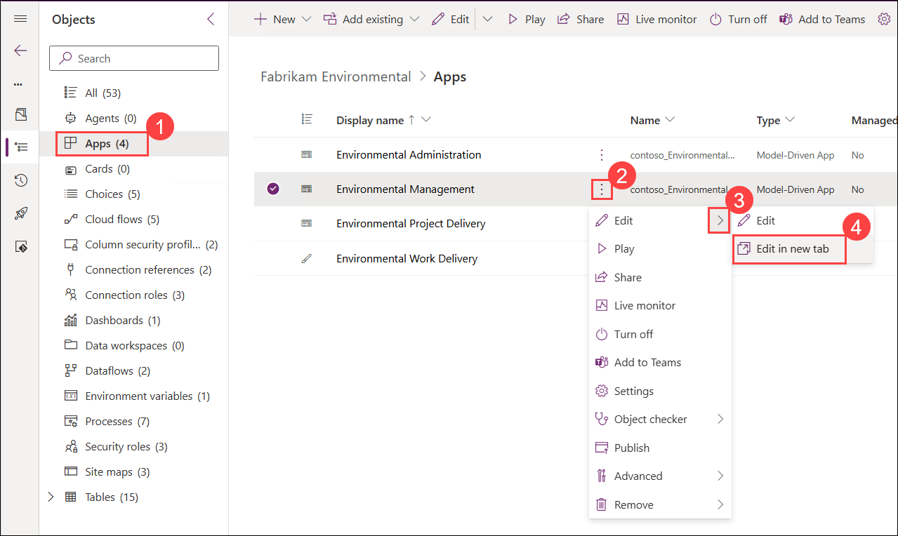

1. Select **+ New**.

1. Select **Dataverse table**.

1. Search for and select **Project Outcome (1)**.

1. Uncheck **Show in navigation (2)**.

1. Select **Add (3)**.

   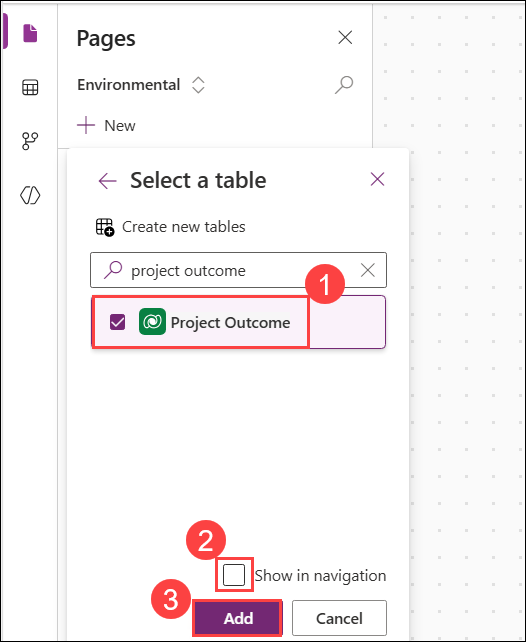

1. Select **+ New**.

1. Select **Dataverse table**.

1. Search for and select **Outcome**.

1. Uncheck **Show in navigation**.

1. Select **Add**.

1. In the **Pages** pane on the left side, select **Outcome forms (1)** under **All other pages**.

1. In the **Outcome forms** pane on the right side, select the ellipsis **(...) (2)** for the **User** form and select **Remove (3)**

    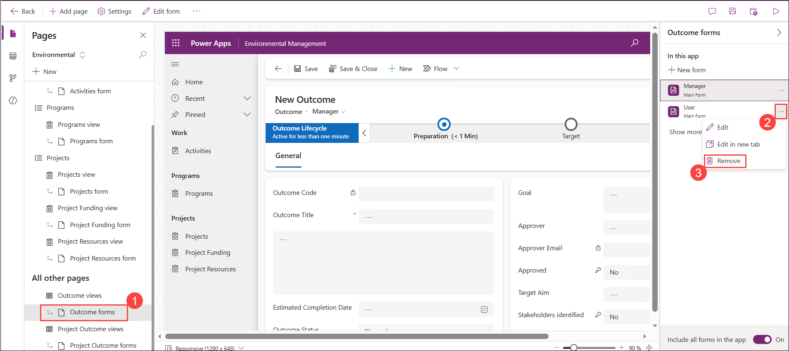

1. Select **Save**.

   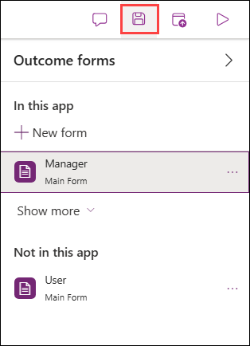

1. Select **Publish**.

1. Select **Play**.

1. Navigate around and interact with the **Environmental Management** app before closing the app and app designer windows.

1. **Close** the app designer window.

1. Select **Done**.

### Task 10.2 – Environmental Project Delivery app

In this task, you will perform the following changes to the app:

- Add Project Outcome table
- Use the User form

1. Select the **Environmental Project Delivery** app, select the **Commands** menu (⋮), and select **Edit** > **Edit in new tab**.

1. Select **+ New**.

1. Select **Dataverse table**.

1. Search for and select **Project Outcome**.

1. Uncheck **Show in navigation**.

1. Select **Add**.

1. In the **Pages** pane on the left side, select **Outcomes form**.

1. In the **Outcomes forms** pane on the right side, select the ellipsis **...** menu on the **Manager** form and select **Remove**.

1. Select **Save**.

1. Select **Publish**.

1. Select **Play**.

   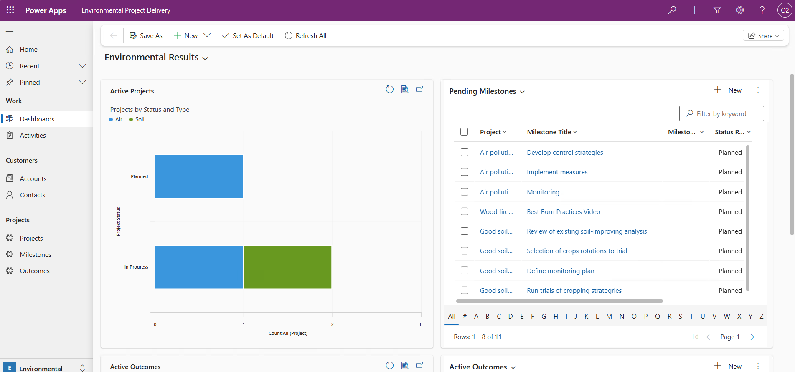

1. Navigate around and interact with the **Environmental Project Delivery** app and then  **Close** the app and app designer windows.

1. Select **Done**.

### Review
In this lab, you edited project forms, program form, program funding form, region form, milestone form, outcome form and project outcome form, created a quick create form, copied outcome form and modified model-driven apps.
