# Lab 3.2: Views

## Scenario

You are a Power Platform functional consultant and have been assigned to the Fabrikam project for the next stage of the project.

In this practice lab, you will be modifying the views for the Fabrikam Environment model-driven apps.

## Lab objectives
In this lab, you will perform:

+ Exercise 1: Project views
+ Exercise 2: Project Funding views
+ Exercise 3: Outcome views
+ Exercise 4: Milestone views
+ Exercise 5: Project Outcome views
+ Exercise 6: Editable grid
+ Exercise 7: Modify model-driven apps
+ Exercise 8: Enable Dataverse Search

## Exercise 1: Project views

In this exercise, you will make changes to the views for the Project table.

### Task 1.1: Modify the Project public view

In this task, you will perform the following changes to the form:

- Add columns to views

1. Navigate to the Power Apps Maker portal `https://make.powerapps.com` .

1. Make sure you are in your **PL Development** environment.

1. Select **Solutions**.

1. Click to open the **Fabrikam Environmental** solution.

1. In the **Objects** pane on the left, expand **Tables**.

1. Select the **Project** table.

1. Under **Data experiences**, select **Views**.

1. Select the **Active Projects (1)** view, select the **Commands** menu **(⋮) (2)**, and select **Edit (3)** > **Edit in new tab (4)**.

    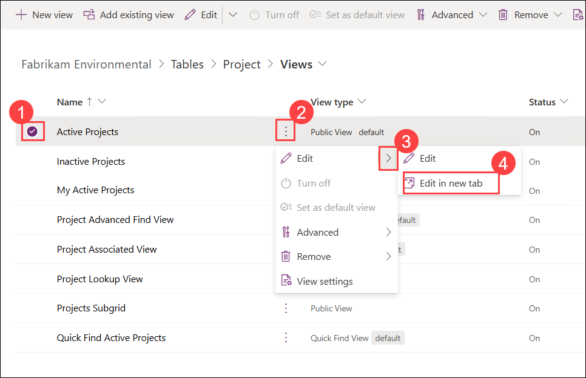

1. Select the **Total Project Funding** column to add to the view.

1. Drag the **Total Project Funding** column to the left of **Project Status**.

    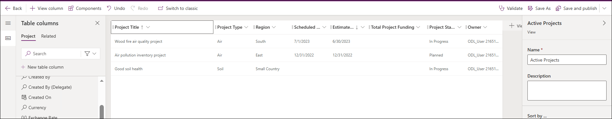

1. On the **Save and publish** drop-down menu, select **Save only**. Do not navigate away from this page.

### Task 1.2: Create new completed projects view

In this task, you will perform the following changes to the form:

- Create a new view
- Set filter
- Remove column

1. Select **Save As (1)**.

1. Enter `Completed Projects` for **Name (2)**.

1. Select **Save (3)**.

    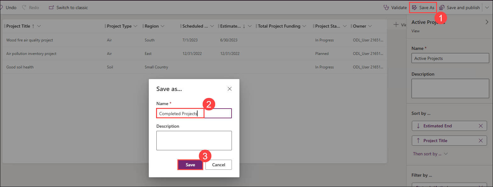

1. Select the caret next to the **Project Status** column and select **Filter by**.

1. Select **Equals** and choose **Completed**.

1. Select **Apply**.

1. Select the caret next to the **Project Status** column and select **Remove**.

    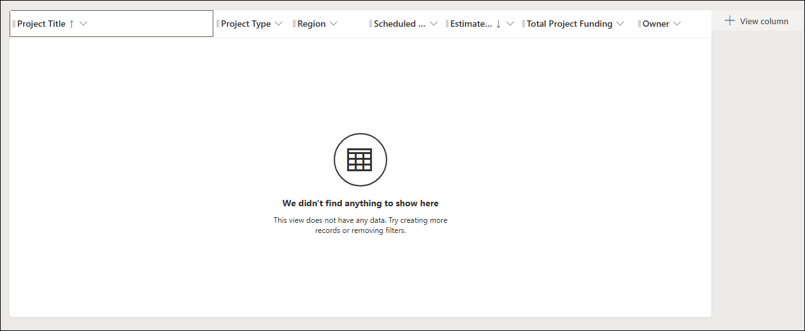

1. On the **Save and publish** drop-down menu, select **Save only**.

1. **Close** the view designer.

1. Select **Done**.

## Exercise 2: Project Funding views

In this exercise, you will make changes to the views for the Project Funding table.

### Task 2.1: Modify the Project Funding public view

In this task, you will perform the following changes to the form:

- Add columns to views

1. Navigate to the Power Apps Maker portal `https://make.powerapps.com`

1. Make sure you are in the **PL Development** environment.

1. Select **Solutions**.

1. Open the **Fabrikam Environmental** solution.

1. In the **Objects** pane on the left, expand **Tables**.

1. Select the **Project Funding** table.

1. Under **Data experiences**, click on **Views**.

1. Select the **Active Project Funding** view, select the **Commands** menu **(⋮)**, and select **Edit** > **Edit in new tab**.

1. Drag the **Funding Amount** column from **Table columns** to between the **Funder** and **Funding Percentage** columns, adding it to the view.

    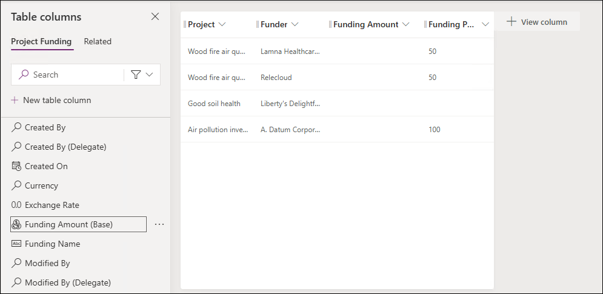

1. On the **Save and publish** drop-down menu, select **Save only**.

1. **Close** the view designer.

1. Select **Done**.

## Exercise 3: Outcome views

In this exercise, you will make changes to the views for the Outcome table.

### Task 3.1: Modify the Active Outcomes public view

In this task, you will perform the following changes to the form:

- Add the Milestone status to public view
- Remove the status reason column

1. Navigate to the Power Apps Maker portal `https://make.powerapps.com`

1. Make sure you are in the **PL Development** environment.

1. Select **Solutions**.

1. Click to open the **Fabrikam Environmental** solution.

1. In the **Objects** pane on the left, click and expand **Tables**.

1. Select the **Outcome** table.

1. Under **Data experiences**, click on **Views**.

1. Select the **Active Outcomes** view, select the **Commands** menu **(⋮)**, and select **Edit** > **Edit in new tab**.

1. Drag the **Outcome status** column to the left of the **Owner** column in the view.

1. Select the caret next to the **Status Reason** column and select **Remove**.

    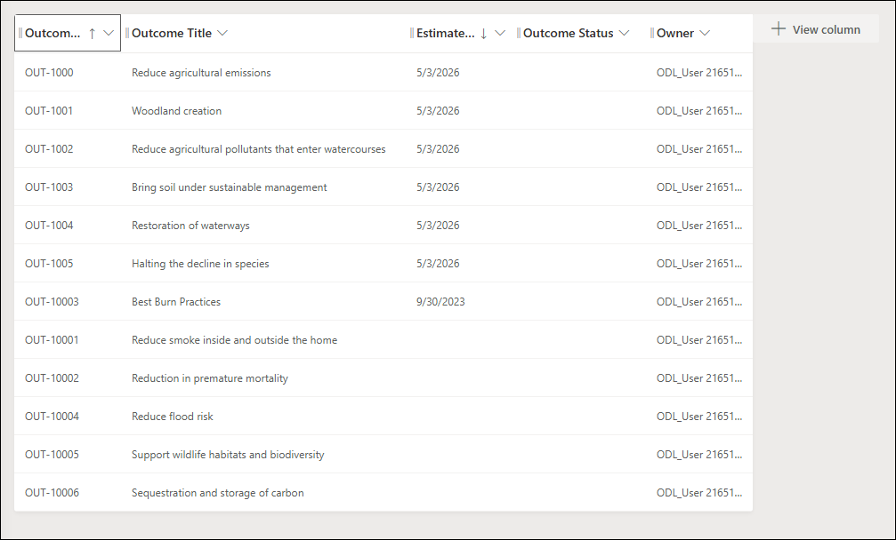

1. On the **Save and publish** drop-down menu, select **Save only**.

1. **Close** the view designer.

1. Select **Done**.

### Task 3.2: Modify the Outcome lookup view

In this task, you will perform the following changes to the form:

- Change the columns in the lookup view for Outcomes

1. Select the **Outcome Lookup View** view, select the **Commands** menu **(⋮)**, and select **Edit** > **Edit in new tab**.

1. Select the caret next to the **Created On** column and select **Remove**.

1. Select the **Target Aim** column to add to the view.

1. Select the **Outcome status** column to add to the view.

    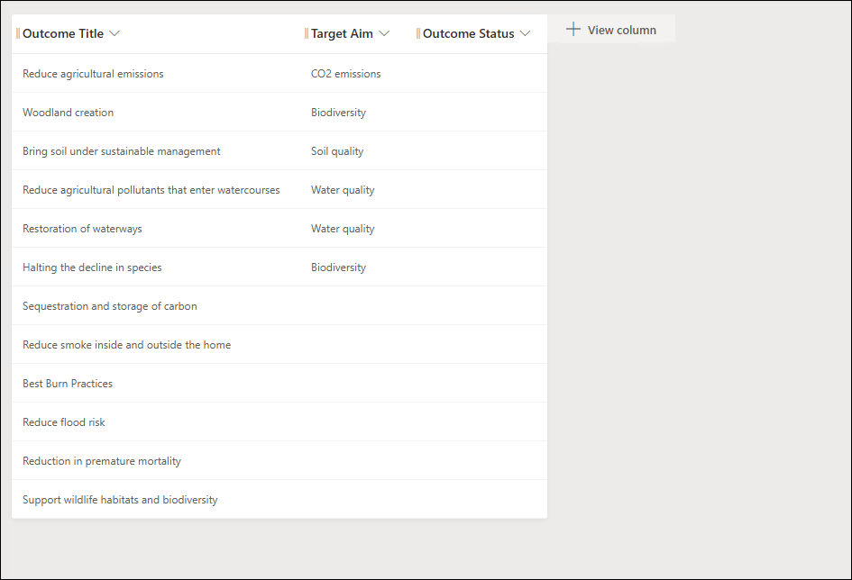

1. On the **Save and publish** drop-down menu, select **Save only**.

1. **Close** the view designer.

1. Select **Done**.

### Task 3.3: Modify the Outcome Quick Find view

In this task, you will perform the following changes to the form:

- Change the find columns in the quick find view

1. Select the **Quick Find Active Outcomes** view, select the **Commands** menu **(⋮)**, and select **Edit** > **Edit in new tab**.

1. Select the caret next to the **Created On** column and select **Remove**.

1. Select the **Target Aim** column to add to the view.

1. Select the **Outcome Status** column to add to the view.

1. Select the **Estimated Completion Date** column to add to the view.

1. In the **Quick Find Active Outcomes** pane on the right, select **Edit find table columns**.

1. Choose the following columns and select **Apply**.

    - Goal
    - Outcome Code
    - Outcome Description
    - Outcome Title
    - Target Aim

        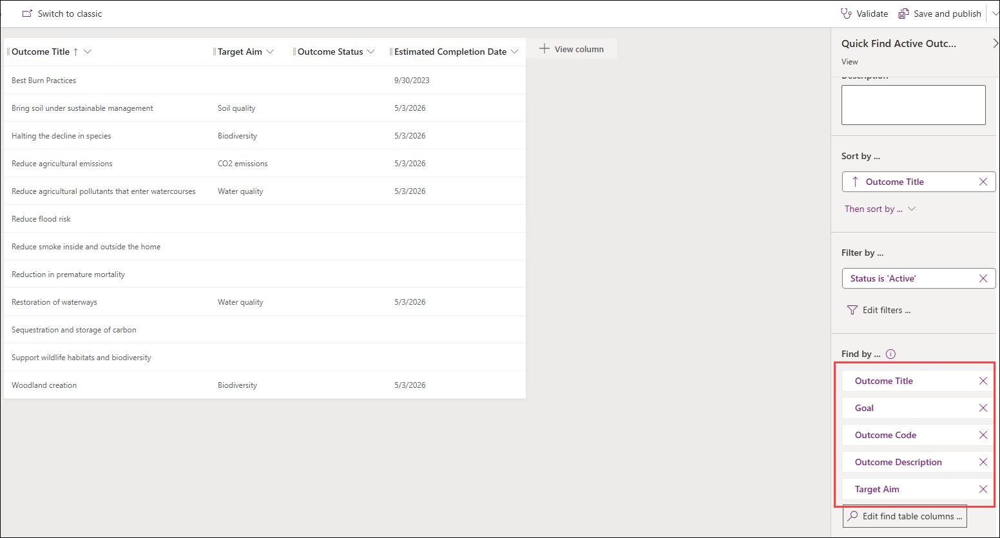

1. On the **Save and publish** drop-down menu, select **Save only**.

1. **Close** the view designer.

1. Select **Done**.

## Exercise 4: Milestone views

In this exercise, you will make changes to the views for the Milestone table.

### Task 4.1: Modify the Active Milestones public view

In this task, you will perform the following changes to the form:

- add the Milestone Status to the public view
- remove the Status Reason column

1. Navigate to the Power Apps Maker portal `https://make.powerapps.com`

1. Make sure you are in the **PL Development** environment.

1. Select **Solutions**.

1. Open the **Fabrikam Environmental** solution.

1. In the **Objects** pane on the left, expand **Tables**.

1. Select the **Milestone** table.

1. Under **Data experiences**, select **Views**.

1. Select the **Active Milestones** view, select the **Commands** menu **(⋮)**, and select **Edit** > **Edit in new tab**.

1. Drag the **Number of Open Tasks** column to the right of the **Milestone Title** column in the view.

1. Drag the **Milestone status** column to the left of the **Owner** column in the view.

1. Select the caret next to the **Status Reason** column and select **Remove**.

    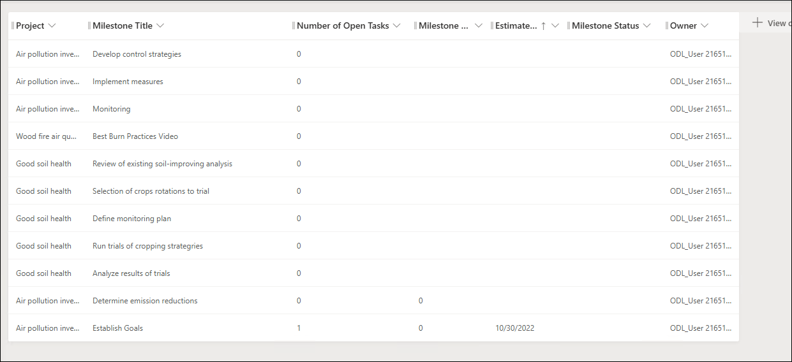

1. On the **Save and publish** drop-down menu, select **Save only**.

1. **Close** the view designer.

1. Select **Done**.

### Task 4.2: Modify the My Pending Milestones public view

In this task, you will perform the following changes to the form:

- Add the Milestone Status to the public view
- Remove the Status Reason column
- Edit the filter

1. Select the **My Pending Milestones** view, select the **Commands** menu **(⋮)**, and select **Edit** > **Edit in new tab**.

1. Drag the **Milestone Status** column to the right of the **Status Reason** column in the view.

1. Select the caret next to the **Status Reason** column and select **Remove**.

1. In the **My Pending Milestones** pane on the right side, select **Edit filters**.

1. In the **Edit filters** pane, change **Status Reason** to **Milestone status (1)**.

1. Change the **Operator** to **Does not equal (2)**.

1. Select **Completed** and **Cancelled (3)**.

1. Select **OK (4)**.

    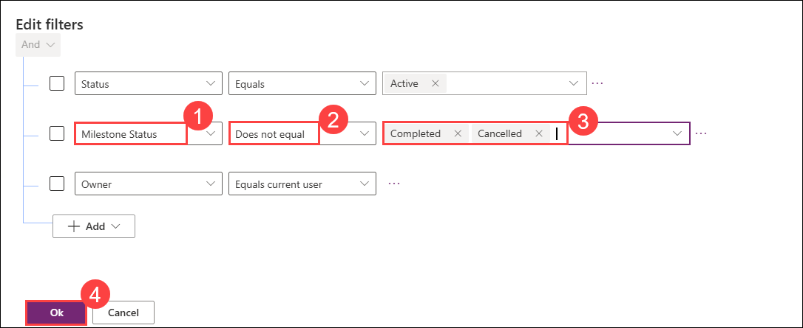

1. On the **Save and publish** drop-down menu, select **Save only**.

1. **Close** the view designer.

1. Select **Done**.

### Task 4.3: Modify the Milestones SubGrid view

In this task, you will perform the following changes to the form:

- Add the Milestone Description to the view
- Add the Milestone Status to the view
- Remove the Status Reason column

1. Select the **Milestones SubGrid** view, select the **Commands** menu **(⋮)**, and select **Edit** > **Edit in new tab**.

1. Drag the **Milestone Description** column to the right of the **Milestone Title** column in the view.

1. Drag the **Milestone Status** column to the right of the **Status Reason** column in the view.

1. Select the caret next to the **Status Reason** column and select **Remove**.

    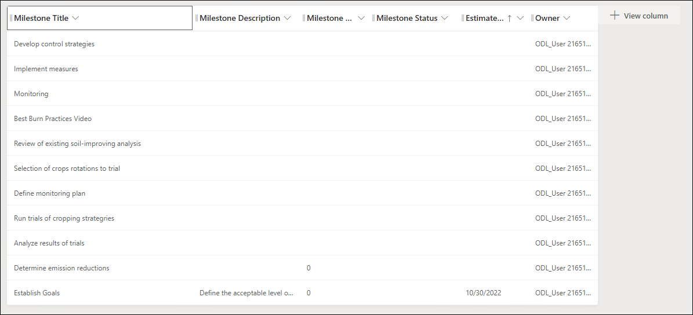

1. On the **Save and publish** drop-down menu, select **Save only**.

1. **Close** the view designer.

1. Select **Done**.

## Exercise 5: Project Outcome views

In this exercise, you will make changes to the views for the Project Outcome table.

### Task 5.1: Modify the Active Project Outcomes public view

In this task, you will perform the following changes to the form:

- Configure the default views created when the table was created

1. Navigate to the Power Apps Maker portal `https://make.powerapps.com`
 
1. Make sure you are in the **PL Development** environment.

1. Select **Solutions**.

1. Open the **Fabrikam Environmental** solution.

1. In the **Objects** pane on the left, expand **Tables**.

1. Select the **Project Outcome** table.

1. Under **Data experiences**, select **Views**.

1. Select the **Active Project Outcomes** view, select the **Commands** menu **(⋮)**, and select **Edit** > **Edit in new tab**.

1. Select the caret next to the **Created On** column and select **Remove**.

1. Select the **Outcome** column to add to the view.

1. Select the **Comments** column to add to the view.

1. Select the **Outcome Completed Date** column to add to the view.

1. Select the caret next to the **Title** column and select **Remove**.

1. In the **Active Project Outcomes** pane on the right side, select **Sort by** and select **Outcome completed date**.

1. Select the **up** arrow to change the sorting to descending.

    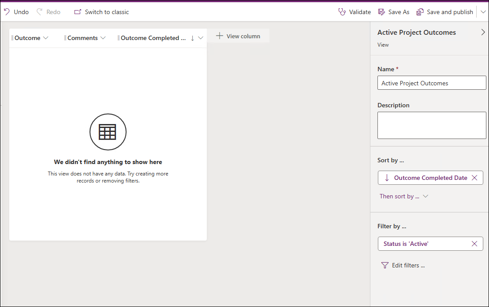

1. On the **Save and publish** drop-down menu, select **Save only**.

1. **Close** the view designer.

1. Select **Done**.

### Task 5.2: Publish changes

1. In the  **Objects** pane on the left, select **All**.

1. Select **Publish all customizations**.

## Exercise 6: Editable grid

In this exercise, you will make changes to a sub-grid in the main form for the Project table to make it editable.

### Task 6.1: Modify the Project main form

In this task, you will perform the following changes to the form:

- Change the Milestone sub-grid to be an editable grid

1. Navigate to the Power Apps Maker portal `https://make.powerapps.com`

1. Make sure you are in the **PL Development** environment.

1. Select **Solutions**.

1. Open the **Fabrikam Environmental** solution.

1. In the **Objects** pane on the left, expand **Tables**.

1. Select the **Project** table.

1. Under **Data experiences**, select **Forms**.

1. Select the **Information** form of type **Main**, select the **Commands** menu **(⋮)**, and select **Edit** > **Edit in new tab**.

1. Select **Components** on the left navigation of the form designer.

1. Select **Get more components (1)**.

1. Select the **Power Apps grid control (2)**.

1. Select **Add (3)**.

    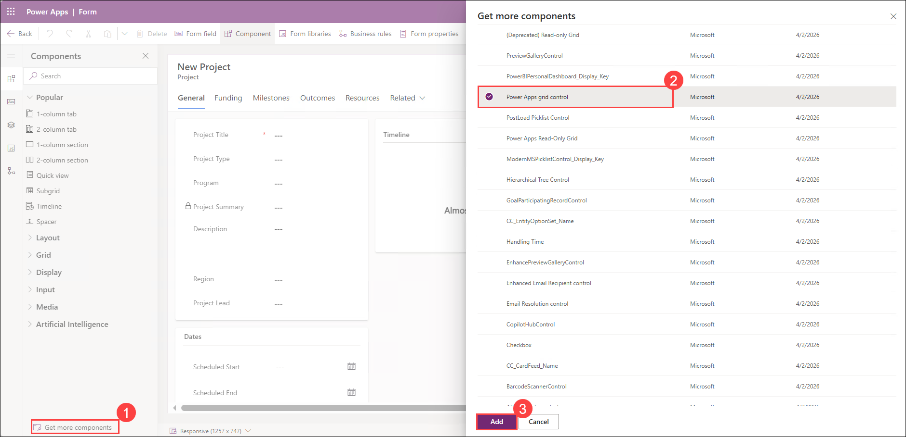

1. Select the **Milestones** tab.

1. Select the **Milestones** sub-grid.

1. In the **Properties** pane on the right, expand **Components**.

1. Select **+ Component**.

1. Select **Power Apps grid control**.

1. Select **Yes** for **Enable editing**.

1. Select **Yes** for **Show data type icons**.

1. Select **Done**.

    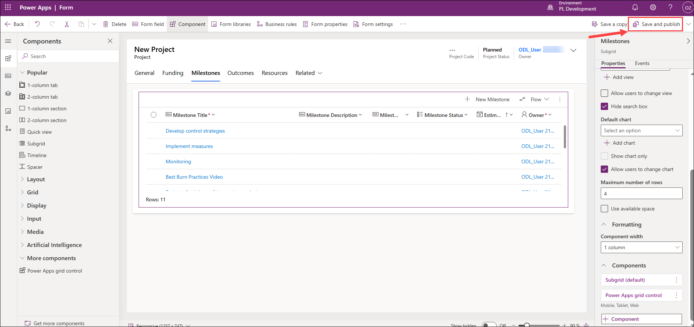

1. Select **Save and publish**.

1. **Close** the form designer.

1. Select **Done**.

## Exercise 7: Modify model-driven apps

In this exercise, you will be restricting views in model-driven apps.

### Task 7.1: Environmental Project Delivery app

In this task, you will perform the following changes to the app:

- Restrict Project views
- Restrict Milestone views
- Restrict Outcome views

1. Navigate to the Power Apps Maker portal `https://make.powerapps.com`.

1. Make sure you are in the **PL Development** environment.

1. Select **Solutions**.

1. Click to open the **Fabrikam Environmental** solution.

1. In the **Objects** pane on the left, click and expand **Apps**.

1. Select the **Environmental Project Delivery** app, select the **Commands** menu **(⋮)**, and select **Edit** > **Edit in new tab**.

1. Under **Projects** in the **Pages** pane on the left-hand side, select **Projects view**.

1. In the **Projects** pane on the right side, select the ellipsis **(...)** on the **Active Projects** view and select **Remove**.

1. In the **Projects** pane on the right side, select the ellipsis **(...)** on the **Inactive Projects** view and select **Remove**.

1. In the **Projects** pane on the right side, select the ellipsis **(...)** on the **Projects Subgrid** view and select **Remove**.

    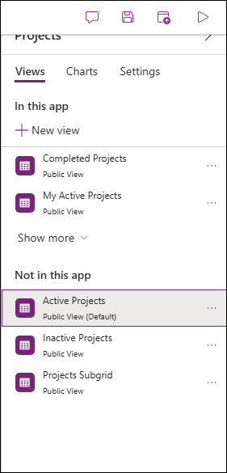

1. Select **Milestones view** from the left **Pages** pane.

1. In the **Milestones** pane on the right side, select the ellipsis **...** on the **Inactive Milestones** view and select **Remove**.

1. In the **Milestones** pane on the right side, select the ellipsis **...** on the **Milestones SubGrid** view and select **Remove**.

1. In the **Pages** pane on the left-hand side, select **Outcomes view**.

1. In the **Outcomes** pane on the right side, select the ellipsis **...** on the **Inactive Outcomes** view and select **Remove**.

1. In the **Outcomes** pane on the right side, select the ellipsis **...** on the **Outcomes SubGrid** view and select **Remove**.

1. Select **Save**.

1. Select **Publish**.

1. Select **Play**. Explore the **Environmental Project Delivery** model-driven app.

    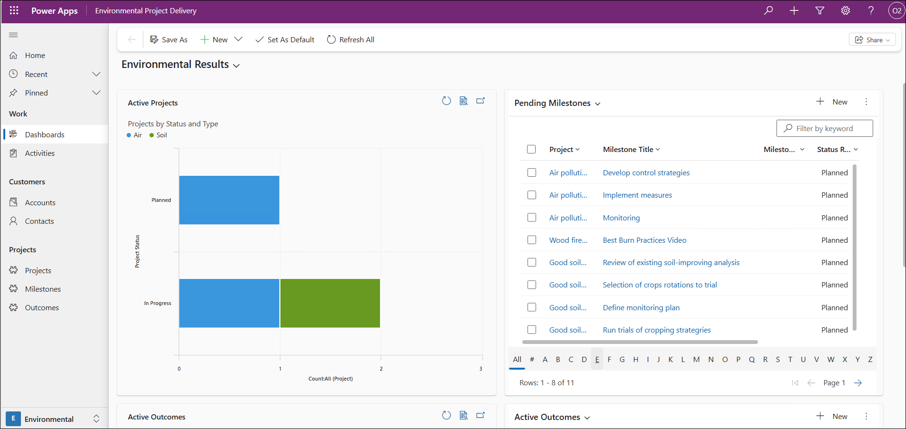

1. **Close** the app and the app designer tabs.

1. Select **Done**.

## Exercise 8: Enable Dataverse Search

In this exercise, you will enable Dataverse search for your environment.

The find columns on the quick find views define the searchable fields in the Dataverse search index.

### Task 8.1: Search settings

1. Navigate to the Power Platform admin center `https://aka.ms/ppac`

1. Select **Manage** and then select **Environments** from the left navigation pane.

1. Select your **PL Development** environment.

1. Select **Settings**.

1. Expand **Product**.

1. Select **Features**.

1. Toggle **Dataverse search** to **On**.

    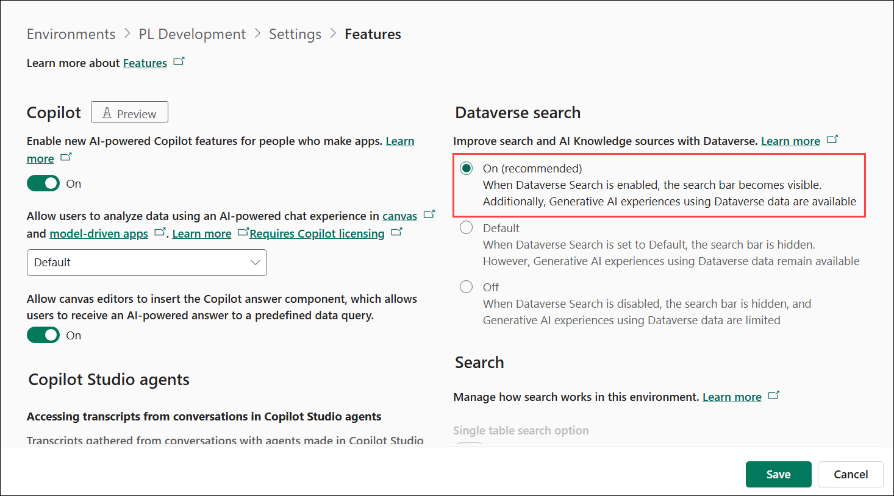

1. Select **Save** at the bottom.

### Task 8.2: Search index

1. Navigate to the Power Apps Maker portal `https://make.powerapps.com`

1. Make sure you are in your **PL Development** environment.

1. Select **Solutions**.

1. Open the **Fabrikam Environmental** solution.

1. In the solution select the **Overview (1)** page.

1. Select **Manage search index (2)**.

    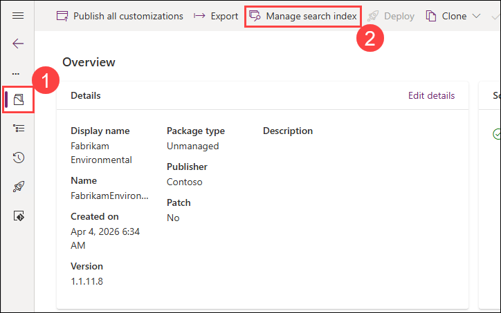

1. In the **Select tables to index for Dataverse search** pane, add the following tables:

    - Outcome **(1)**
    - Project Funding **(2)**
    - Resource **(3)**

1. Select **Save (4)**.

    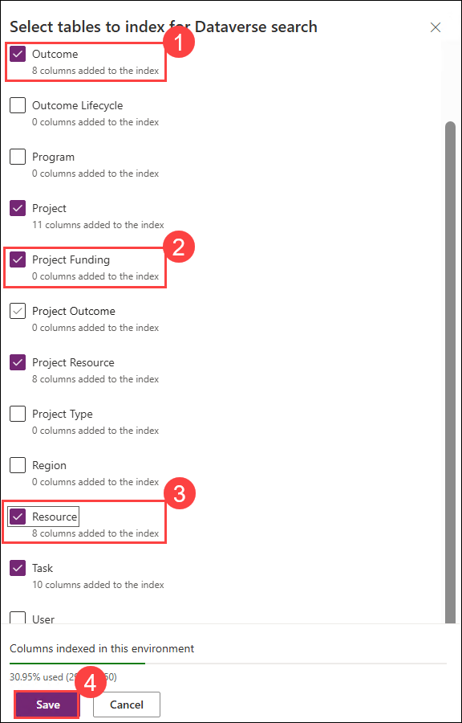

### Task 8.3: Publish changes

1. Select **Publish all customizations**.

## Review
In this lab, you customized multiple views across tables by adding, removing, and filtering columns, created new views, and configured sorting. You enabled editable grids, refined model-driven app views, and configured Dataverse search to improve data accessibility and user experience. Great work!

### You have successfully completed the lab. Click on Next >> to proceed with the next lab.

