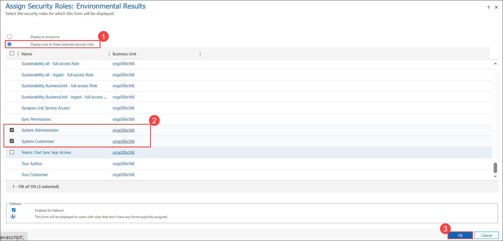
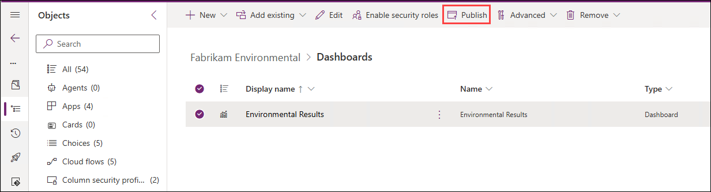
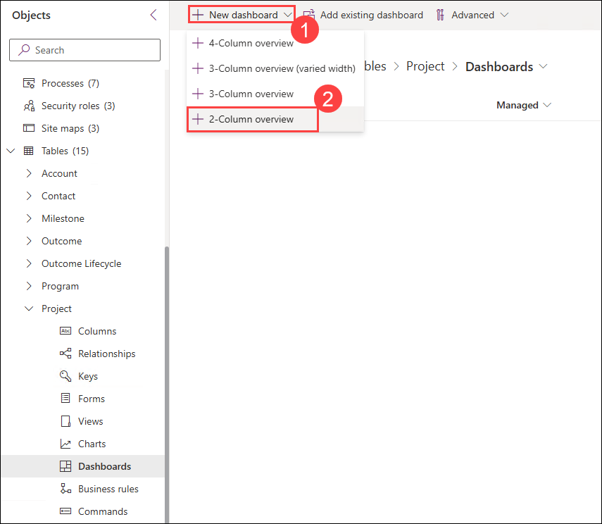
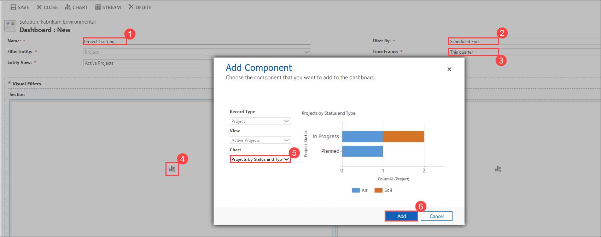
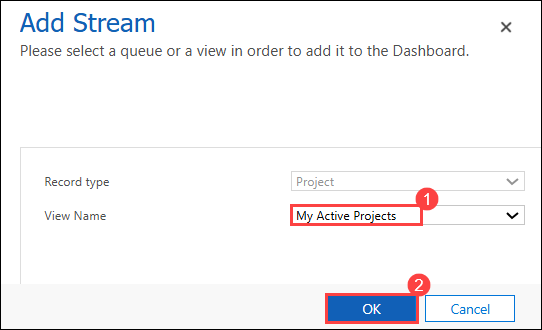
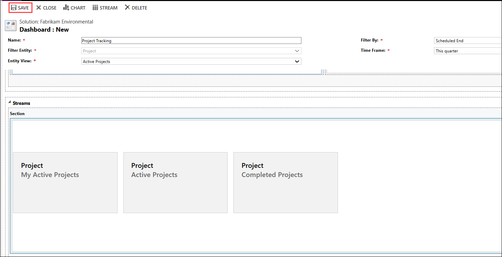
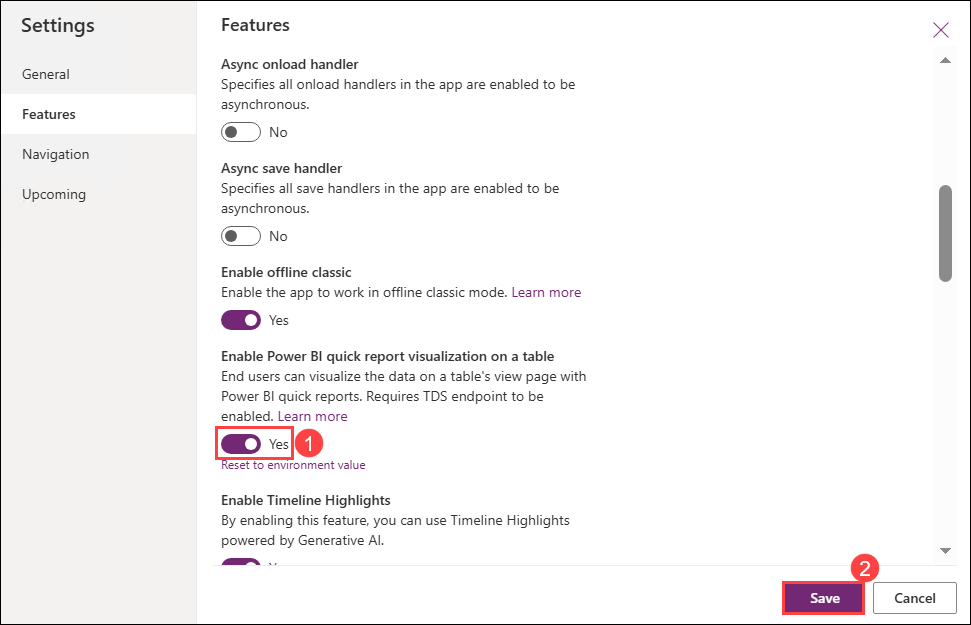
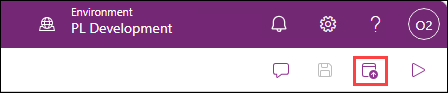

# Lab: Dashboards (Optional)

## Scenario

You are a Power Platform functional consultant and have been assigned to the Fabrikam project for the next stage of the project.

In this practice lab, you will be creating an interactive dashboard and adding it to a Fabrikam Environment model-driven app.

## Lab objectives
In this lab, you will perform:

+ Exercise 1: Dashboard security
+ Exercise 2: Create an interactive dashboard
+ Exercise 3: Enable Power BI quick reports

## Exercise 1: Dashboard security

In this exercise, you will assign security roles to the existing dashboard.

### Task 1.1 – Assign roles to dashboard

1. Navigate to the Power Apps Maker portal `https://make.powerapps.com`

1. Make sure you are in the **PL Development** environment.

1. Select **Solutions**.

1. Open the **Fabrikam Environmental** solution.

1. In the **Objects** pane on the left, select **Dashboards**. You should see a single dashboard.

1. Select the **Environmental Results** dashboard (do not open it) and select **Enable security roles**.

1. Select the **Display only to these security roles (1)** radio button.

1. Deselect all security roles.

1. Select the following security roles **(2)**:

    - Environmental user
    - System Administrator
    - System Customizer

1. Select **OK (3)**.

    

1. Select **Publish**.

    

## Exercise 2: Create an interactive dashboard

In this exercise, you will create an interactive dashboard for Projects.

### Task 2.1: Create a dashboard

1. Navigate to the Power Apps Maker portal `https://make.powerapps.com`

1. Make sure you are in the **PL Development** environment.

1. Select **Solutions**.

1. Open the **Fabrikam Environmental** solution.

1. In the **Objects** pane on the left, expand **Tables**.

1. Select the **Project** table.

1. Under **Data experiences**, select **Dashboards**.

1. Select **+ New dashboard (1)** > **2-Column overview (2)**.

    

1. Enter `Project Tracking` for **Name (1)**.

1. Select **Scheduled End (2)** in the **Filter By** drop-down.

1. Select **This Quarter (3)** in the **Time Frame** drop-down.

1. In the first pane under **Visual Filters (4)**, select the chart icon.

1. Select the **Projects by Status and Type (5)** chart and select **Add (6)**.

    

1. In the **Streams** pane, select the stream icon.

1. Select the **My Active Projects (1)** view and select **OK (2)**.

    

1. In the toolbar, select **Stream**.

1. Select the **Active Projects** view and select **OK**.

1. In the toolbar, select **Stream**.

1. Select the **Completed Projects** view and select **OK**.

1. Select **Save**.

    

1. Select **Close**.

1. Select **Done**.

1. In the **Objects** pane on the left, select **All**.

1. Select **Publish all customizations**.

## Exercise 3: Enable Power BI quick reports

In this exercise, you will be enabling the feature that uses Power BI to create a report from a model-driven app view.

### Task 3.1: Environmental Project Delivery app settings

1. Navigate to the Power Apps Maker portal `https://make.powerapps.com`

1. Make sure you are in the **PL Development** environment.

1. Select **Solutions**.

1. Open the **Fabrikam Environmental** solution.

1. In the **Objects** pane on the left, expand **Apps**.

1. Select the **Environmental Project Delivery** app, click on the ellipses **(⋮)**, and select **Edit** > **Edit in new tab**.

1. In the action bar, select **Settings**.

1. Select **Features**.

1. Toggle **Enable Power BI quick report visualization on a table** to **Yes (1)**.

1. Select **Save (2)**.

    

1. Select **Publish**.

    

1. Select **Play**. Explore the Environmental Project Delivery app. 

1. **Close** the app and the app designer tabs.

1. Select **Done**.

### Review
In this lab, you configured dashboard security, created an interactive dashboard, enabled Power BI report.

