# Lab 4.1 – Enhance a canvas app

## Scenario  
You are a Power Platform functional consultant working with the Contoso team. You’ve been asked to create a simple Canvas app that allows users to view and update milestone records stored in Microsoft Dataverse.

This lab will take approximately **30** minutes to complete. 

## Lab Objectives

+ Exercise 1: Create Canvas App from Milestones Table

## Exercise 1: Create Canvas App from Milestones Table

### Task 1.1: Create Canvas App
1. Navigate to `https://make.powerapps.com`.
2. Ensure you are in the **PL Development** environment.
3. In the Maker Studio, select **Apps**.
4. Select **Start with data**.
5. Choose **Dataverse**

   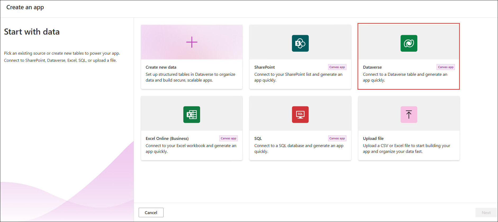

6. Search for **(1)** and select the **Milestone (2)** table.
7. Click **Create app (3)** to generate the app.

   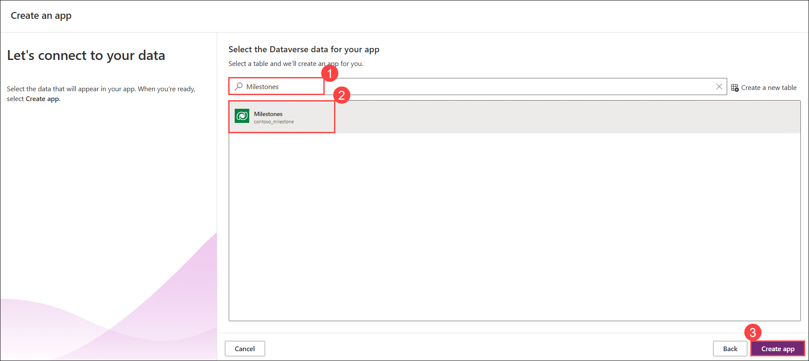

8. Select **Save.**

   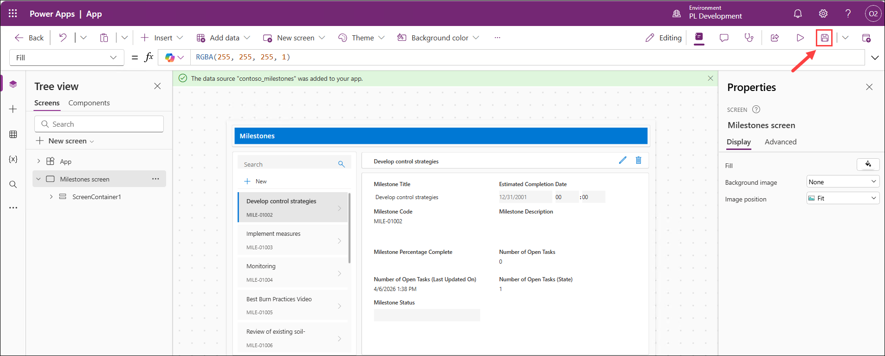

9. Enter the name **Environmental Milestones App (1)**.

10. Click **Save (2)** again.

      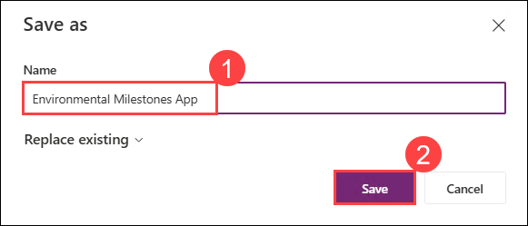

### Task 1.2: Configure Gallery
1. Expand **ScreenContainer1 (1)**.
2. Expand **BodyContainer1 (2)**.
3. Expand **SidebarContainer1 (3)**.
4. Select the default gallery named **RecordsGallery1 (4)**.
5. Rename it to **MilestoneGallery (5)**.

   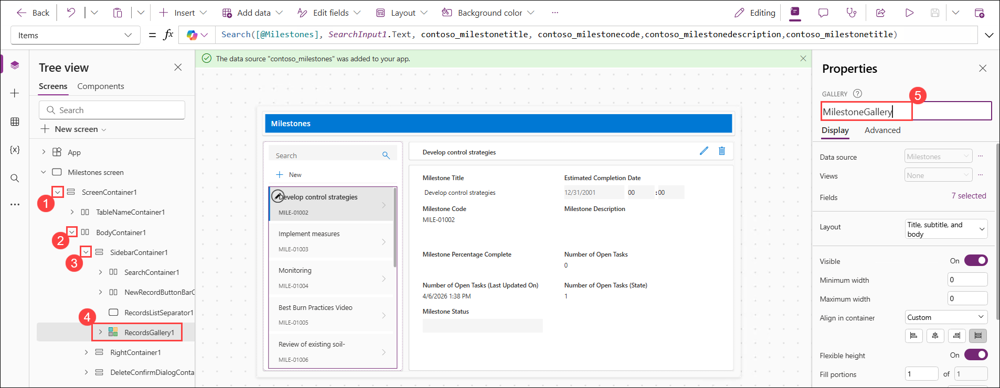

6. In the **Properties** pane on the right, change the layout to **Title and Subtitle**.
7. Find the **Fields** and change the fields by selecting **X selected (1)**.
8. Edit the fields shown in the gallery:
   - Subtitle2: Select **contoso_milestonecode**
   - Title2: Select **contoso_milestonetitle**
9. Verify the fields selected now read **(2)**:
    - Subtitle2: **ThisItem.'Milestone Code'**
    - Title2: **ThisItem.'Milestone Title'**

      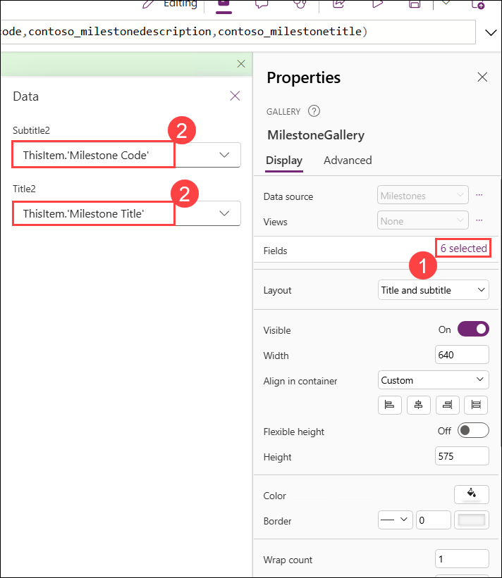

### Task 1.3: Configure Form
1. Expand **BodyContainer1 (1)**.
2. Expand **RightContainer1 (2)**.
3. Expand **MainContainer1 (3)**.
5. Select the default form named **Form1 (4)**.
6. Rename it to **MilestoneForm (5)**.

   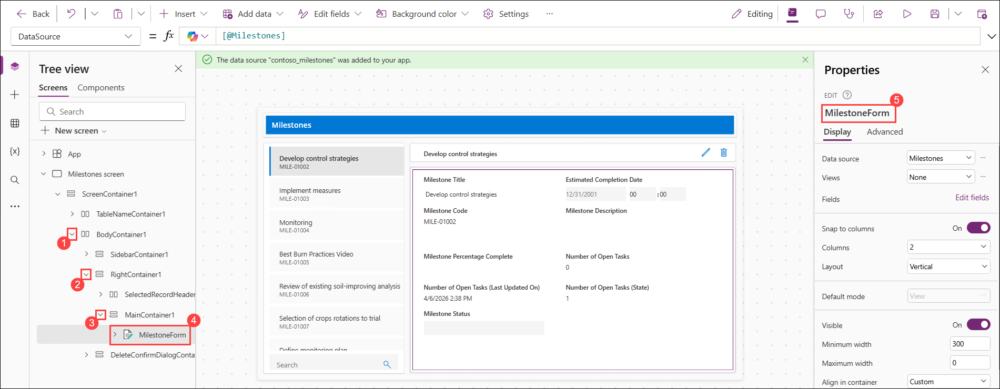

7. In the Properties pane, change the column layout to **1**.
8. Edit the fields shown in the form. Add, remove, and drag to reorder them so that they look like the list below:
   - **Milestone Code**
   - **Milestone Title**
   - **Milestone Description**
   - **Milestone Percentage Complete**
   - **Milestone Status**

      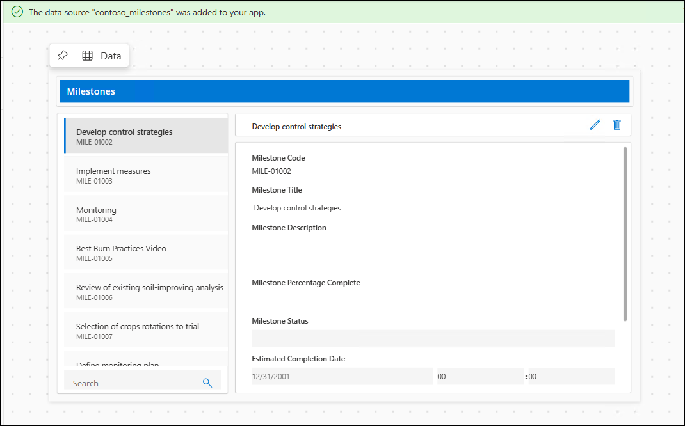

9. Return to the tree view. Expand **RightContainer1 (1)** (if it is not already expanded).
10. Expand **SelectedRecordHeaderContainer1 (2)**.
12. Rename the submit button from **SubmitFormButton1 (3)** to **SaveBtn (4)**.

      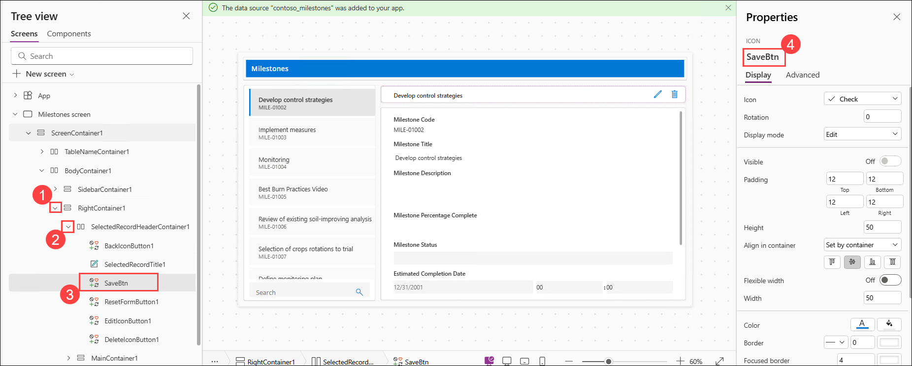

13. Select **Save (1)**.
14. Select **Publish (2)**.

      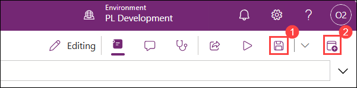

15. Select **Publish this version**.

      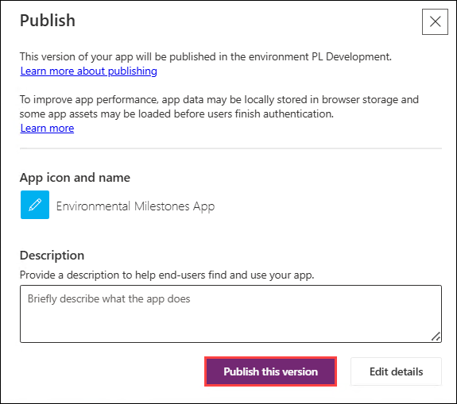

## Review

